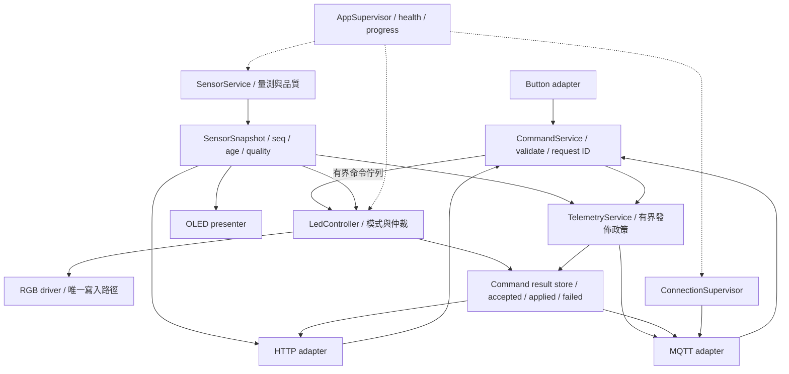

# 物聯網軟體架構：評估、改進與第一性原理技術樹

> 2026-10-05 修正更新：已針對按鈕 LED 問題加入預設關閉的光感自動控制開關，並讓熄燈保留所選色碼。下文對「熄燈清除色碼」的評估屬於修正前現況；完整 LedController／AUTO／MANUAL 仲裁仍為改進提案，尚未實作。

本文件以目前 ESP32／MicroPython 教學專案為案例，接續 `SYSTEM_ARCHITECTURE.md`。現況依本地程式碼分析，改進均為提案，尚未改寫韌體或進行實機驗證。目的是讓學生能說明「為什麼選擇某種架構，以及它在什麼條件下成立」。

## 一、對目前架構的判斷

目前是「分層模組化的裝置端應用」，由單一 `uasyncio` 事件迴圈執行九個應用任務，另有 MQTT 函式庫背景任務。它適合第一階段的整合實驗，但要成為完整的軟體架構教材，還需要加入明確的狀態模型、介面契約、故障策略、資源預算與可驗證的品質目標。

多個檔案是模組化的起點；架構的品質取決於改變與故障能否被限制在合理範圍，以及不同元件能否對「現在的狀態」與「操作是否完成」達成一致。

### 優點與可保留部分

| 優點 | 本專案證據 | 架構／教學價值 | 成立條件 |
|---|---|---|---|
| 規模容易掌握 | 一塊裝置、DHT／ADC／OLED／按鈕／LED | 能觀察完整端到端流程，適合作為共同基線 | 明確限制功能與資料量 |
| 初步責任分離 | `hardware`、`communication`、`tasks`、`main` | 可教抽象、封裝、相依關係與組裝 | 後續避免政策滲入驅動、協定滲入核心 |
| 協同多工適合低速 I/O | 感測器與顯示秒級、按鈕毫秒級 | 可教排程、等待、阻塞與任務協作 | 長時間操作必須讓出執行權 |
| 同時包含本地與遠端介面 | 按鈕、OLED、Web、MQTT | 可比較互動、查詢、命令及事件 | 不同介面需共用一致的應用服務 |
| 遙測採快取 | DHT 任務量測，其他任務讀快取 | 避免每個查詢都觸發感測器操作 | 快取應附時間與品質資訊 |
| 有事件驅動雛形 | `publish_event` | 可教生產者與消費者解耦 | 必須接受事件合併，或改為有界佇列 |
| 有容錯意識 | MQTT 初始重試、OLED 失敗降級、任務捕捉例外 | 可引導學生設計部分可用系統 | 需明確故障狀態及恢復條件 |
| 有遲滯控制雛形 | 光照開／關使用不同門檻 | 可教物理噪聲如何影響軟體設計 | 必須保留期望顏色與正確的控制狀態 |

### 缺點：從程式問題提升成架構問題

| 架構問題 | 目前表現 | 影響 | 建議 |
|---|---|---|---|
| 沒有唯一狀態擁有者 | 光感、按鈕、Web 直接操作 LED | 使用者操作很快被自動控制覆寫 | LED controller 統一仲裁 |
| 狀態概念混合 | `off()` 同時消除已選顏色 | 熄燈後暗時仍保持黑色 | 拆分期望顏色、使能、實際輸出、模式 |
| 契約不完整 | MQTT 同步回呼收到 async 函式；訂閱 callback 被忽略 | 設計中的遠端控制不會正常執行 | 明確回呼簽章與命令入口，寫介面整合測試 |
| 成功語意不明 | HTTP 接受事件就回「published」 | 前端誤以為網路操作已完成 | 區分 accepted、sent、broker_ack、applied |
| 資料品質不明 | DHT 失敗用 -1 覆寫快取；沒有新鮮度 | 故障值容易被誤當有效觀測 | 量測值與 valid／age／error 分離 |
| 恢復狀態不足 | 連線旗標可能過期、重連未重訂閱 | 看起來在線但功能不完整 | 網路狀態機與連線世代、訂閱恢復 |
| 任務存活缺少管理 | 部分任務退出後只記錄錯誤 | 系統可能一直活著但服務已停止 | 任務監督與必要／可選服務分類 |
| 過載策略缺少定義 | Event 合併請求，沒有 queue／request ID | 請求丟失無法辨識，無法追蹤完成 | 先決定保留每筆或只保留最新，再選機制 |
| 配置／部署不可重現 | 巢狀 lib、字型路徑不符、Microdot 缺少 | 不同學生環境結果不同 | 固定韌體、函式庫版本與裝置部署清單 |
| 安全邊界不足 | HTTP 無認證、MQTT 共用 topic、原始碼憑證 | 同網段或 Broker 使用者可能干擾 | 依信任邊界設計身份、授權、加密 |
| 難以替換與離線測試 | 模組全域共享物件、直接 import 硬體 | 測政策需要真實板子與網路 | 將控制規則寫成可注入時鐘與驅動的核心 |
| 缺乏量化目標 | 沒有延遲、queue、記憶體等預算 | 難以判斷改進是否有效 | 先定義可測的品質情境 |

## 二、從第一性原理推導架構

不要先從 MQTT、雲端或框架名稱出發。先承認下列不可避開的事實，再決定抽象與工具。

| 基本事實 | 推導出的必要問題 | 對應架構能力 |
|---|---|---|
| 物理世界連續且有雜訊，程式只取得有限樣本 | 樣本代表什麼？何時不可信？ | 量測模型、校正、去彈跳、遲滯、資料品質 |
| CPU、RAM、Flash、電量與執行時間有限 | 過多工作來時捨棄什麼？多久完成？ | 預算、排程、有界佇列、背壓 |
| 多個來源可能要求同一致動器做不同動作 | 誰有權決定最後輸出？ | 狀態擁有權、命令模型、控制仲裁 |
| 網路會延遲、斷線，回覆也可能遺失 | 失敗是未執行，還是執行後未收到回覆？ | 超時、重試、冪等、確認、離線策略 |
| 裝置和函式庫會變，錯誤會發生 | 能否替換元件、定位故障並安全恢復？ | 介面契約、相依注入、監督、可觀測性、可重現部署 |
| 遠端輸入可能不可信 | 誰可讀、誰可改、輸入能用多少資源？ | 驗證、授權、加密、限流 |
| 課程需要證明學習成果 | 怎樣證明某種設計優於另一種？ | 品質情境、測試、量測、架構決策紀錄 |

因此本專案建議的設計目標是：**在有限資源與不可靠網路下，使感測資訊可判讀、控制權可解釋、操作結果可追蹤、基本功能可持續、故障可定位。**

## 三、第一性原理技術樹

這是能力分解樹，不表示每個節點都需要獨立套件或獨立程序。A01～H04 共 32 個節點，下一節逐一用相同六個問題解釋。

```text
根：可信且可持續的「觀測 → 決策 → 動作 → 確認」
├─ A 需求與邊界：先定義要維持什麼
│  ├─ A01 品質情境與不變條件
│  ├─ A02 系統／信任邊界
│  ├─ A03 分層、介面契約與相依注入
│  └─ A04 配置與可重現部署
├─ B 物理世界：資訊怎樣變可信
│  ├─ B01 GPIO／ADC／I2C／SPI 與硬體抽象
│  ├─ B02 取樣、去彈跳、濾波與遲滯
│  ├─ B03 量測品質、快照與新鮮度
│  └─ B04 單調時間與牆上時間
├─ C 有限資源：工作怎樣共存
│  ├─ C01 協同多工與阻塞預算
│  ├─ C02 Event、Queue 與背壓
│  ├─ C03 狀態擁有權、原子性與 Lock
│  └─ C04 記憶體、頻寬、Flash 與功耗預算
├─ D 控制語意：誰決定動作
│  ├─ D01 命令、事件與查詢
│  ├─ D02 有限狀態機與控制仲裁
│  ├─ D03 期望／已套用／已觀測狀態
│  └─ D04 驗證、冪等與命令確認
├─ E 分散通訊：跨網路怎樣合作
│  ├─ E01 HTTP API 與輪詢／推送
│  ├─ E02 MQTT 發佈訂閱與主題命名
│  ├─ E03 Schema、QoS、retain、session 與 LWT
│  └─ E04 裝置／閘道／雲端分工
├─ F 故障恢復：失效後如何繼續
│  ├─ F01 連線狀態機、超時與退避
│  ├─ F02 離線策略與 store-and-forward
│  ├─ F03 任務監督、降級與 watchdog
│  └─ F04 冷啟動、持久化與安全輸出
├─ G 安全：誰可以做什麼
│  ├─ G01 威脅模型與身份佈建
│  ├─ G02 認證、授權與最小權限
│  ├─ G03 TLS、憑證與秘密管理
│  └─ G04 資源防護、更新與回復
└─ H 證據：怎樣證明架構有效
   ├─ H01 日誌、指標與關聯 ID
   ├─ H02 契約／政策／故障測試
   ├─ H03 架構決策與演進實驗
   └─ H04 歷史資料與端到端追溯（條件式）
```

閱讀順序可採 A → B → C → D → E → F → G → H；實作時 A01、G01、H02 應提早介入。樹以外的進階技術，例如 RTOS、多核心、Kubernetes、數位孿生平台，需由明確需求再展開，不能由名詞流行度推導。

## 四、逐點技術與觀念說明

### A01 品質情境與不變條件

- **使用時機：**開始設計、比較方案或驗收時。
- **使用前提：**知道使用者、操作環境與主要失敗情境；若未知，先把假設記錄下來。
- **是什麼：**將「快、穩、可靠」變成可測情境，並定義任何時候都必須成立的規則。
- **為什麼：**沒有目標，就無法判斷增加 queue、TLS 或重試是否值得。
- **做什麼：**規定回應時間、資料新鮮度、可用功能與資源上限。例如 LED 只能由一個 controller 寫入。
- **怎麼做：**寫成「條件→刺激→預期→量測」；例如 MQTT 斷線時按鈕／OLED仍可用、手動模式不被光感覆寫。數值門檻先作課程假設，再用實機校準。

### A02 系統／信任邊界

- **使用時機：**決定哪些功能放板上、哪些由外部提供，以及資料可被誰碰到時。
- **使用前提：**列出裝置、AP、Browser、Broker、管理者與外部服務。
- **是什麼：**區分責任、部署位置、故障範圍與可信來源的邊界。
- **為什麼：**同網段不代表可信；Broker 存活也不代表命令已被硬體執行。
- **做什麼：**識別跨邊界的資料、命令與依賴，決定驗證及確認的位置。
- **怎麼做：**畫 context 圖及資料流，標註每條連線的協定、身份、故障後行為；本地照明由裝置保有決策權，雲端不可成為基本按鈕功能的必要依賴。

### A03 分層、介面契約與相依注入

- **使用時機：**硬體／協定會替換，或控制政策需要離線測試時。
- **使用前提：**能先定義精簡操作與資料，不需要搬入大型框架。
- **是什麼：**讓驅動、通訊轉接器與核心政策透過約定介面合作；組裝層提供具體物件。
- **為什麼：**隔離變動；本專案回呼問題就是契約未一致，而非分檔不足。
- **做什麼：**定義同步／非同步、型別、例外、完成語意、超時與所有權。
- **怎麼做：**`main` 建立 `SensorService`、`LedController`、`CommandService` 再傳給 Web／MQTT adapter；核心接受假的 driver／clock。只建立必要介面，避免每個函式都套抽象類別。

### A04 配置與可重現部署

- **使用時機：**多位學生、多塊板子、重裝環境或更新版本時。
- **使用前提：**確認板型、韌體版本、函式庫來源與授權。
- **是什麼：**用明確版本與檔案清單建立同一執行環境，將裝置差異作配置。
- **為什麼：**import 路徑與 API 版本不一致會使相同程式表現不同。
- **做什麼：**固定 dependencies、GPIO mapping、部署路徑與資產位置，區分公開設定與秘密。
- **怎麼做：**整理單層 `/lib`、提供不含秘密的設定範本、固定 Microdot／mqtt_as 版本或 commit、記錄檔案雜湊；部署後先執行 import／字型／HTML smoke check。`boot.py` 非必要時保持精簡。

### B01 GPIO／ADC／I2C／SPI 與硬體抽象

- **使用時機：**接入數位輸入輸出、類比感測或周邊裝置時。
- **使用前提：**核對實際 ESP32 變體的可用腳位、電壓、上拉、匯流排與模組規格。
- **是什麼：**GPIO 表示電位、ADC 將電壓量化；I2C／SPI 是不同的周邊通訊方式；HAL 用穩定介面封裝它們。
- **為什麼：**電氣條件與板型限制不能靠 Python 類別消除。
- **做什麼：**提供 `read()`、`measure()`、`apply_output()`，統一驅動錯誤與輸出規約。
- **怎麼做：**將接腳與尺寸由設定注入，開機檢查周邊；光感先保留 raw ADC，只有經校正才能宣稱 lux。ADC 範圍與 API 依實際韌體／板型確認，參考 [MicroPython ESP32 文件](https://docs.micropython.org/en/latest/esp32/quickref.html)。

### B02 取樣、去彈跳、濾波與遲滯

- **使用時機：**輸入會抖動、雜訊引起誤判、或致動器在門檻旁頻繁切換時。
- **使用前提：**知道訊號變化速度、感測器最小量測間隔、容許延遲與雜訊規模。
- **是什麼：**取樣決定觀察頻率；去彈跳辨識穩定按鈕；濾波降低波動；遲滯用不同進入／離開條件維持狀態。
- **為什麼：**物理波動不能直接等同於有意義的狀態變化。
- **做什麼：**減少假觸發與快速反覆開關，同時控制增加的延遲。
- **怎麼做：**保留目前按鈕穩定檢查；ADC 可先做短窗中位數／移動平均；controller 保存亮／暗狀態並使用 1000／1100 門檻。頻率與門檻以量測調整，慢速 DHT 不用照搬高速訊號的取樣要求。

### B03 量測品質、快照與新鮮度

- **使用時機：**多個消費者讀感測值、失敗後仍顯示舊值，或需要判斷資料是否可控制時。
- **使用前提：**有單一量測來源與可計算 age 的時鐘。
- **是什麼：**包含值、品質、時間與版本的一份一致資料快照。
- **為什麼：**數字本身無法說明是不是故障值、過期值或相同次量測。
- **做什麼：**區分成功觀測、最後成功值、最近嘗試與錯誤；允許 UI、MQTT、控制器採用不同 stale 策略。
- **怎麼做：**DHT 成功才更新 last-good；失敗更新 error／valid，回傳 `value`、`sample_seq`、`age_ms`、`quality`。組好新 dict 後替換快照，讀者不得修改；-1 不再充當通用錯誤標記。

### B04 單調時間與牆上時間

- **使用時機：**排程、去彈跳、超時、freshness、事件跨裝置對照時。
- **使用前提：**知道系統時鐘是否已校時，且處理 tick 回繞。
- **是什麼：**單調時間用來算間隔；牆上時間是可校正的日曆時間。
- **為什麼：**NTP 調整可能使日曆時間前跳或後跳，不能直接當超時計時器。
- **做什麼：**把本地延遲與跨裝置時間標記分開。
- **怎麼做：**期限與 age 使用 `ticks_ms()`／`ticks_diff()`，按平台 tick 有效間隔限制使用；遙測附 UTC 時間與 `time_synced`，UI 才轉 UTC+8；加 `boot_id + seq` 區分重啟前後。不要把未知牆上時間偽裝成精確時間。

### C01 協同多工與阻塞預算

- **使用時機：**一個 MCU 同時等按鈕、感測、HTTP 與 MQTT，工作大多是低速 I/O 時。
- **使用前提：**可將長工作拆段或取得可等待 I/O；硬時限需求要另行評估。
- **是什麼：**task 在等待點讓出事件迴圈，交錯執行多項工作。
- **為什麼：**提高等待期間的利用率，但 `async def` 不會自動將同步呼叫變非阻塞。
- **做什麼：**限制每段連續占用時間與排程延遲。
- **怎麼做：**以實測找出 WiFi／NTP／DHT 阻塞，建立 timeout 與非阻塞包裝；CPU 長計算分批。若確實有微秒級硬時限，再考慮 IRQ、硬體周邊或 RTOS，而非先增加 thread。

### C02 Event、Queue 與背壓

- **使用時機：**生產者與消費者速度不同，或請求需要等待處理時。
- **使用前提：**先決定是否必須保留每筆、順序與完成結果。
- **是什麼：**Event 表示某條件成立；Queue 保存工作項；背壓規定容量不足時如何處理。
- **為什麼：**無限排隊會耗盡 RAM，Event 又不能計數或追蹤每個請求。
- **做什麼：**為每類工作選擇合併、丟棄、等待或拒絕策略。
- **怎麼做：**最新遙測可合併；每筆手動命令用有界 queue 和 request ID，滿時回 429／503；用本地已驗證相容的 queue 實作。IRQ 若只需通知，改用 `ThreadSafeFlag`，普通 `Event.set()` 限於事件迴圈 task，見 [asyncio 文件](https://docs.micropython.org/en/latest/library/asyncio.html)。

### C03 狀態擁有權、原子性與 Lock

- **使用時機：**多個 task／來源改同一裝置或共享多欄位狀態時。
- **使用前提：**畫出讀／寫者以及可能交錯的 await 點。
- **是什麼：**所有權指定誰能寫；原子性確保一次轉移一致；Lock 排除某段操作的交錯。
- **為什麼：**Lock 可以避免交錯，但無法決定手動與自動誰優先。
- **做什麼：**先統一政策與寫入者，再保護必要的共享操作。
- **怎麼做：**只有 LedController task 能寫 GPIO，其餘來源送命令；資料快照一次替換。不得在持有共享狀態鎖時等待 MQTT 網路回覆；單 task 的短小無 await 轉移通常無需額外鎖。

### C04 記憶體、頻寬、Flash 與功耗預算

- **使用時機：**長時間運作、多人同時查詢、加 TLS、離線緩存或電池供電時。
- **使用前提：**有實機資源量測與最大負載假設。
- **是什麼：**為有限資源預留可量測的上限與餘裕。
- **為什麼：**平均能運作不代表尖峰時能維持服務；頻繁 Flash 寫入也有壽命成本。
- **做什麼：**限制 payload、HTTP 連線、queue、日誌、緩存及寫入頻率。
- **怎麼做：**每台瀏覽器目前約 1 次查詢／秒，N 台約 N 次／秒；queue RAM 約容量×實際物件大小，需包含 Python overhead。記錄最小 free heap、GC 延遲與尖峰負載；只有電池情境再討論 deep sleep，且需調整持續 HTTP 服務需求。

### D01 命令、事件與查詢

- **使用時機：**按鈕、Web、MQTT 共同操作系統，或設計 API／topic 時。
- **使用前提：**能區分意圖、已發生事實與唯讀需求。
- **是什麼：**命令要求改變，事件描述已發生的結果，查詢讀取狀態。
- **為什麼：**收到命令不是動作完成，查詢也不應偷偷改變業務狀態。
- **做什麼：**建立一致入口與清楚命名，將協定格式隔離在轉接器。
- **怎麼做：**`SetLedColor`、`SetMode`、`RequestPublish` 進 CommandService；`LedApplied`、`PublishFailed` 是事件；HTTP 查詢讀 SensorSnapshot。此分類不要求建立完整 CQRS 或 event-sourcing 系統。

### D02 有限狀態機與控制仲裁

- **使用時機：**輸出取決於模式、前一狀態或來源優先序時。
- **使用前提：**定義合法狀態、轉移、衝突政策與超時。
- **是什麼：**用明確狀態與事件決定下一狀態，而非分散 if 修改硬體。
- **為什麼：**光感、按鈕與遠端指令互相覆寫是政策衝突，不只是 race condition。
- **做什麼：**管理 AUTO、MANUAL、可選 FAULT_SAFE，以及遲滯亮／暗子狀態。
- **怎麼做：**課程先定「手動設定進 MANUAL；明確 SetMode(AUTO) 才回自動」；AUTO 用光感決定 enabled，MANUAL 由使用者指定。緊急優先序僅在確有安全需求時加入，並用轉移表驗證。

### D03 期望／已套用／已觀測狀態

- **使用時機：**軟體命令不等於硬體實際結果，或使用者想知道目前設定與輸出時。
- **使用前提：**知道致動器是否有實體回授。
- **是什麼：**desired 是意圖；applied 是驅動已寫入；observed 是感測確認的物理結果。
- **為什麼：**寫了 GPIO 不等於 LED 一定亮；共用一個色碼也會丟失使用者設定。
- **做什麼：**保留意圖，呈現命令與輸出的差異。
- **怎麼做：**分開 `desired_color`、`enabled`、`applied_mask`、`mode`；關燈只使 applied=0，不清除 desired。本專案無 LED 回授，僅宣稱 GPIO 已套用，不能宣稱物理亮燈已確認。

### D04 驗證、冪等與命令確認

- **使用時機：**遠端命令會重送、使用者可能重按，或需追蹤結果時。
- **使用前提：**有命令 schema、request ID、身份與可接受的去重保存範圍。
- **是什麼：**驗證決定可否接受；冪等讓重複操作不增加效果；確認報告目前完成階段。
- **為什麼：**網路回覆遺失使呼叫者不知道先前是否已執行。
- **做什麼：**避免重送造成額外換色，分清 accepted／applied／failed。
- **怎麼做：**遠端優先用 `set_color(4)`，而非 `next_color()`；驗證 0～7，不以 `%8` 掩蓋錯誤；暫存有界 request ID 結果。需跨重啟去重時另做持久化；不能宣稱 RAM 去重具有跨重啟保證。

### E01 HTTP API 與輪詢／推送

- **使用時機：**瀏覽器查詢裝置或人為操作；資料更新頻率與客戶數有限時先用輪詢。
- **使用前提：**具體客戶端、延遲與 MCU 連線預算已知。
- **是什麼：**請求／回應介面；輪詢定期查詢，推送在更新時送出資料。
- **為什麼：**狀態碼與回應內容是協作契約；改 WebSocket 不會自動解決狀態問題。
- **做什麼：**區分有效查詢、完成、接受處理、輸入錯誤與服務不可用。
- **怎麼做：**用 JSON serializer；queued publish 回 202 與 request ID，提供結果查詢；無可用服務回 503；前端用 `??` 保留 0、恢復連線狀態。若有大量即時資料再比較 SSE／WebSocket 的連線成本。202 不代表處理完成，見 [HTTP Semantics](https://www.rfc-editor.org/rfc/rfc9110.html#section-15.3.3)。

### E02 MQTT 發佈訂閱與主題命名

- **使用時機：**多個訂閱者、裝置主動上報、跨裝置／服務解耦時。
- **使用前提：**可控 Broker、獨立裝置身份與 topic 授權；單裝置本地操作未必需要 MQTT。
- **是什麼：**透過 Broker 將 topic 上的消息分派給訂閱者。
- **為什麼：**裝置不用掌握每個消費者位置，但增加 Broker 故障與治理責任。
- **做什麼：**分開 telemetry、command、ack、status，避免不同學生互相控制。
- **怎麼做：**例如 `course/{group}/{device}/telemetry`、`.../cmd`、`.../ack`、`.../status`；穩定且唯一 client ID；同步 MQTT 回呼快速解析／入隊，由工作 task 處理，再用契約測試確認與目前 vendored 函式庫相容。

### E03 Schema、QoS、retain、session 與 LWT

- **使用時機：**訊息需跨版本、辨識重複、通知在線狀態或在重連後恢復時。
- **使用前提：**確認使用的是 MQTT 3.1.1、Broker 設定與本地 mqtt_as 能力，避免套用 MQTT 5 專屬功能。
- **是什麼：**Schema 規定 payload；QoS 管傳輸交付；retain 保存 topic 的最近訊息；session 管連線狀態；LWT 是異常斷線通知。
- **為什麼：**協定保證與應用完成保證不同；retain 也不是歷史資料庫。
- **做什麼：**定義版本、身份、時間、序號與品質；依消息用途選傳輸與保存政策。
- **怎麼做：**遙測可選 QoS0；需傳輸確認用 QoS1 並去重；cmd 預設不 retain；status 可 retain 並搭配 LWT／heartbeat。clean session 重連後重訂閱；持久 session 仍須處理過期命令。QoS 不等於物理動作恰好執行一次，參考 [MQTT 3.1.1 規範](https://docs.oasis-open.org/mqtt/mqtt/v3.1.1/mqtt-v3.1.1.html)。

### E04 裝置／閘道／雲端分工

- **使用時機：**裝置數、歷史查詢、使用者與集中管理需求成長時。
- **使用前提：**先知道網路拓樸、資料量、運維能力與斷網需求。
- **是什麼：**依延遲、可靠性、資源與責任決定計算與儲存位置。
- **為什麼：**基本控制依賴雲端會擴大故障範圍；所有歷史資料放 MCU 會壓迫資源。
- **做什麼：**本地保留感測／控制；外部服務承擔聚合、歷史與多使用者功能。
- **怎麼做：**本課程先保留單裝置；多人整合可加本地 Broker／gateway；有跨地點及歷史需求再加後端與資料庫。只有需要獨立部署、擴縮與團隊 ownership 時才評估微服務。

### F01 連線狀態機、超時與退避

- **使用時機：**任何長時間網路連線或可重試操作。
- **使用前提：**區分 WiFi 與 MQTT、可重試錯誤與永久設定錯誤。
- **是什麼：**用 offline／connecting／online／backoff 表示真實連線生命週期。
- **為什麼：**布林旗標容易過期，多台裝置立即重試會造成同時衝擊。
- **做什麼：**更新狀態、限制等待、恢復訂閱、避免重複重連管理。
- **怎麼做：**接函式庫連線／斷線事件；每次連線成功恢復訂閱清單；指數退避加 jitter 和上限。先確認 mqtt_as 已做哪些事，adapter 補足狀態與政策，不另建競爭的 reconnect loop。

### F02 離線策略與 store-and-forward

- **使用時機：**斷網時有資料或命令仍需保留。
- **使用前提：**清楚允許資料丟失量、保留時間、Flash 耐寫與復原順序。
- **是什麼：**離線期間選擇保留最新、緩存部分或可靠保存後補送。
- **為什麼：**所有資料永久保存不切實際；過期控制命令也可能有害。
- **做什麼：**為遙測與命令分別定 TTL、容量、丟棄與重送政策。
- **怎麼做：**課程基線可只保留最新遙測並記 dropped；若評量要求完整曲線，再用有界批次持久緩存，加入 boot／seq 去重。設定顏色可保留最新意圖；toggle、過期命令不自動補執行。

### F03 任務監督、降級與 watchdog

- **使用時機：**服務需長時間運行，任務可能例外退出或卡住時。
- **使用前提：**定義必要／可選服務、可安全重啟的任務與恢復上限。
- **是什麼：**監督器管理 task 存活與重啟；降級保留核心服務；watchdog 對失去進展的系統重置。
- **為什麼：**捕捉例外後無限迴圈重試可能掩蓋永久錯誤；任務消失也未必使主程式退出。
- **做什麼：**追蹤進展與故障，控制重啟頻率，停止不安全輸出。
- **怎麼做：**OLED 為可選、controller 為必要；supervisor 記退出與 last-progress，有限次重啟後降級。watchdog 僅在必要任務有進展時餵食；不能由獨立無條件心跳證明整體健康。

### F04 冷啟動、持久化與安全輸出

- **使用時機：**斷電、重啟、更新或輸出涉及風險時。
- **使用前提：**定義哪些狀態值得保存與重啟後的安全策略；本專案 LED 風險低。
- **是什麼：**將 volatile 狀態與需跨重啟的設定分開，讓恢復結果可預期。
- **為什麼：**RAM 狀態會消失；重播舊命令或直接恢復危險輸出可能不適當。
- **做什麼：**保存設定版本、合理檢查、boot identity，以及確定的輸出初始狀態。
- **怎麼做：**開機先使 LED 關閉，讀取配置後進入明確模式；只於設定變更且經 debounce／批次時寫 Flash，不每 50ms 寫入。使用可恢復的暫存／替換策略並做斷電測試；不要假設每種檔案系統具有相同原子保證。

### G01 威脅模型與身份佈建

- **使用時機：**開始接網路，尤其共用教室或外部 Broker 時。
- **使用前提：**列出資產、攻擊來源、信任邊界與可接受風險。
- **是什麼：**分析誰可能偽造命令、讀取資料或耗盡資源，並建立裝置初始身份。
- **為什麼：**topic 名稱不是秘密，隔離 SSID 也不等於身份驗證。
- **做什麼：**識別裝置與操作者，定義佈建、撤銷與重置方式。
- **怎麼做：**每組獨立 device ID／憑證或 token，記錄所有者；實驗 Broker 限定課程範圍。先評估本地 Browser 操作與遠端 MQTT 的不同威脅，避免對所有通道套同一假設。

### G02 認證、授權與最小權限

- **使用時機：**有人可以遠端讀取或改變裝置時。
- **使用前提：**有可辨識的身份與可管理的權限政策。
- **是什麼：**認證確認身份；授權決定允許動作；最小權限限制能力範圍。
- **為什麼：**登入成功不代表可以控制所有學生的裝置。
- **做什麼：**區分 read／control／admin，限制 topic 與 API 權限。
- **怎麼做：**Broker ACL 僅準 device 發自己的 telemetry／ack、訂自己的 cmd；Browser 控制需驗證會話或 token。若用 cookie 會話，對改狀態請求設計 CSRF 防護；禁止用網頁內固定管理秘密代替身份管理。

### G03 TLS、憑證與秘密管理

- **使用時機：**資料或憑證跨不可信網路；有身份偽造與竊聽風險時。
- **使用前提：**韌體具備所需 TLS／驗證能力，有 RAM、CA、時間與更新流程。
- **是什麼：**TLS 提供傳輸保護與端點驗證；秘密管理處理憑證儲存、分發與輪替。
- **為什麼：**只有加密但不驗證伺服器，仍無法充分確認連到正確端點。
- **做什麼：**防止竊聽／篡改，避免共用金鑰暴露擴大影響。
- **怎麼做：**採用驗證過的 TLS 配置並量測握手 RAM；每裝置不同秘密，不提交到原始碼，設撤銷機制。資源不足可用受管理閘道承擔外部 TLS，但必須承認裝置至閘道仍有獨立信任邊界。

### G04 資源防護、更新與回復

- **使用時機：**接受外部 payload、長時間部署或需要修補漏洞時。
- **使用前提：**有命令長度與速率上限；做 OTA 前需具備可驗證更新和失敗回復機制。
- **是什麼：**限制不可信輸入的成本，並管理軟體的可控變更。
- **為什麼：**合法連線也可能耗盡 RAM；不完整更新可能使裝置無法開機。
- **做什麼：**拒絕過大／過快輸入，防止未授權更新，保留可恢復版本。
- **怎麼做：**限制 JSON bytes、queue、連線與命令速率；課程先用有版本的手動部署。OTA 僅於確有需求再加入簽章／可信 manifest、完整性檢查、啟動確認與 rollback，並驗證韌體／Flash 分割區支援。

### H01 日誌、指標與關聯 ID

- **使用時機：**故障不在面前、多個來源請求難追蹤或需要比較架構時。
- **使用前提：**定義哪些事件值得觀察、可用儲存與輸出成本。
- **是什麼：**日誌描述事件，指標描述持續狀態，ID 串接一次操作的各階段。
- **為什麼：**「系統正常」無法說明感測是否新鮮、MQTT 是否可用與命令有沒有執行。
- **做什麼：**讓接收、入隊、套用、發佈、失敗可追蹤。
- **怎麼做：**記 `boot_id/request_id/component/action/result`；指標含 sample age、queue depth、dropped、reconnect count、minimum free heap；固定長度 ring buffer，限流日誌且遮蔽秘密。

### H02 契約／政策／故障測試

- **使用時機：**修改回呼、控制優先序、網路恢復或資料模型時。
- **使用前提：**核心能注入 fake driver／clock，並保留實機驗證路徑。
- **是什麼：**契約測試驗證元件接口，政策測試驗證狀態轉移，故障測試驗證失敗後的承諾。
- **為什麼：**正常展示不能證明競爭來源、重複命令與斷網情況下仍正確。
- **做什麼：**以架構風險選擇測試，而不是逐行鏡像程式。
- **怎麼做：**測熄燈保色、MANUAL 不被光感覆寫、MQTT 同步回呼確實入隊、DHT 失敗保留品質資訊、重連重訂閱、queue 滿回拒絕；實機拔網路、模擬感測錯誤並測回應時間。桌面 fake 不能取代電氣與韌體測試。

### H03 架構決策與演進實驗

- **使用時機：**選 Event／Queue、HTTP／MQTT、本地／雲端或同步／非同步時。
- **使用前提：**有需求、候選方案與可取得的量測證據。
- **是什麼：**用簡短 ADR 記錄背景、選擇、替代方案、代價與重評條件。
- **為什麼：**技術選擇沒有脫離情境的絕對優劣；後人需要知道當時的假設。
- **做什麼：**使取捨可討論、可實驗、可修改。
- **怎麼做：**例如對比「Event 合併最新上報」與「有界 Queue 保留每筆請求」，量測 burst、RAM、完成追蹤；設定重評條件為多使用者／不可丟資料，而非「之後全面微服務化」。

### H04 歷史資料與端到端追溯（條件式）

- **使用時機：**需要趨勢、報表、稽核或跨裝置分析；只顯示當前狀態時不必加入。
- **使用前提：**有外部儲存服務、資料保留政策、身份與時間／序號品質。
- **是什麼：**把觀測、命令與結果長期保存並可對照。
- **為什麼：**RAM 快取與 MQTT retain 都不能提供完整歷史；命令送達也不能證明動作結果。
- **做什麼：**串接 device／boot／seq／request ID，保留品質與來源。
- **怎麼做：**Broker 訂閱者寫外部資料庫，以 `(device_id, boot_id, seq)` 去重；設 retention、查詢索引與缺口標記。只有需要可重播的完整业務事件及重建規則時才評估 event sourcing，普通遙測不必導入。

## 五、建議的目標架構

保持單一 MCU 與單一事件迴圈。改進重點是穩定政策、契約與故障行為，不需要先加入大型平台。



建議職責：

- **drivers/**：只管硬體與直接 I/O，保持目前硬體封裝的優點。
- **core/**：資料、命令、LED 政策與狀態轉移，盡量不依賴 `machine`／`network`。
- **services/**：排程感測、命令處理、遙測、連線與監督。
- **adapters/**：HTTP／MQTT／按鈕轉換資料與意圖，不自行決定控制優先序。
- **main.py**：唯一組裝位置，提供具體 driver、clock、config。

這是責任地圖，不必一次搬動所有目錄。小型課程可先用少數新類別在現有結構內實現，避免以大量樣板掩蓋核心概念。

### 共同資料與命令範例

以下為建議契約，不是目前 API 已提供的欄位；採普通 dict 即可，不假設 MicroPython 支援桌面端所有資料模型套件。

```json
{
  "schema_version": 1,
  "device_id": "group01-device01",
  "boot_id": "boot-identifier",
  "seq": 42,
  "time_synced": false,
  "observed_at_utc": null,
  "temperature": {"value": 26, "unit": "C", "quality": "valid", "age_ms": 450},
  "humidity": {"value": 60, "unit": "%", "quality": "valid", "age_ms": 450},
  "light": {"value": 950, "unit": "adc_raw", "quality": "valid", "age_ms": 30}
}
```

```json
{"schema_version":1,"request_id":"r-001","type":"set_led","color":4,"mode":"MANUAL"}
```

```json
{"request_id":"r-001","status":"applied","desired_color":4,"applied_mask":4,"mode":"MANUAL"}
```

端點驗證請求是否合法、來源是否有權；controller 決定是否合法轉移；driver 負責寫 GPIO。HTTP 與 MQTT 應走相同服務入口。遙測收到 Broker 的確認應報告 broker_ack，而不能宣稱所有訂閱者已消費；LED 無回授時 applied 只代表寫入操作。

## 六、分階段改進方案與驗收

### P0：先建立可重現、語意正確的基線

**實施：**整理部署路徑並固定依賴；修正 MQTT 同步回呼與指令派發；統一 JSON serializer、前端零值及恢復顯示；檢查 `wait_connected()` 結果；API 不再將觸發等同完成。

**驗收：**新環境依據部署清單能啟動；MQTT 命令確實進入處理路徑；0 值顯示正確；缺少服務／連線時有明確失敗；發布請求與發布結果可區別。

### P1：核心架構改善，作為課程必做

**實施：**建立 SensorSnapshot、LedController、CommandService；LED 單一寫入者；分離 desired／enabled／applied；明確 AUTO／MANUAL；Web、按鈕、MQTT 共用命令入口；用 request ID 與有界 queue 管需要逐筆處理的命令。

**驗收：**AUTO 暗→亮→暗能恢復選定顏色；MANUAL 不被光感覆蓋；感測失敗有 quality／age；命令滿載會拒絕而非耗盡 RAM；重複 `set_color` 無額外換色。

### P2：加入長時間運作與故障設計

**實施：**區分 WiFi／MQTT 狀態；恢復訂閱；設超時與重試政策；實現真實健康狀態、任務監督、關鍵路徑進展；量測排程延遲與 RAM。課堂接網路時同時落實獨立身份、topic 隔離與必要授權，不能等最後才考慮安全。

**驗收：**Broker 中斷時本地控制可用；恢復後訂閱正常；OLED 故障不會停止本地控制；永久錯誤不會無限高速重試；負載提高時 queue 與 heap 均有界。

### P3：依據明確情境選擇擴充

| 需求觸發 | 可選方案 | 必須支付的成本／前提 |
|---|---|---|
| 多組裝置協作 | 自管課堂 Broker、topic ACL、外部 dashboard | 身份佈建、服務運維、網路故障測試 |
| 要完整歷史曲線 | MQTT ingestion＋外部資料庫 | Schema、去重、時間品質、retention |
| 斷網也不能丟關鍵遙測 | 有界持久緩衝、補送 | Flash 成本、TTL、容量與斷電恢復 |
| 多台瀏覽器且高頻更新 | 比較 gateway 聚合、SSE／WebSocket | 長連接 RAM、鑑權與背壓 |
| 跨不可信網路 | 驗證伺服器的 TLS、必要時受管 gateway | 憑證、RAM、時間、信任邊界 |
| 遠端維護大量裝置 | 安全 OTA、版本回報與 rollback | Flash／boot 支援、簽章、恢復驗證 |
| 微秒級硬時限 | 硬體外設、IRQ、RTOS 或更合適平台 | 重新建立時序與共享狀態模型 |

這些擴充不以「功能越多分數越高」評量，而看學生是否說清楚選擇條件、限制與證據。

## 七、建議的教學實驗與評量

| 實驗 | 學生必須回答的架構問題 | 交付證據 |
|---|---|---|
| 1：畫出現況與邊界 | 誰讀／寫狀態？哪些是已實現或預留？ | Context／component 圖、讀寫表 |
| 2：控制衝突與狀態機 | 自動／手動衝突時應怎樣決定？ | 轉移表、單一寫入實現、衝突測試 |
| 3：感測失敗與時間 | 舊值／故障值如何顯示？NTP 修正影響什麼？ | Snapshot 契約、fake clock 測試、錯誤截圖 |
| 4：命令與通信 | accepted／sent／ack／applied 有何差別？ | HTTP／MQTT 契約、request ID 追蹤 |
| 5：斷網與過載 | 哪些功能繼續？緩衝滿了丟什麼？ | 故障注入記錄、queue／RAM／延遲資料 |
| 6：多裝置與安全 | 怎樣避免跨組控制？憑證如何撤銷？ | Topic ACL、身份配置、拒絕測試 |
| 7：架構選型 | 為什麼採用此方案？何時必須換？ | 簡短 ADR、對照實驗、重評條件 |

可供課程調整的評量比例：需求與契約 20%、狀態與責任設計 25%、故障／資源策略 25%、驗證證據 20%、決策表達 10%。這只是建議，不是現有課程規定。

示範品質情境可先設為「按鈕至 GPIO 套用 p95 <150ms、DHT 快取超過 5 秒標 stale、恢復網路後 30 秒內恢復命令訂閱、命令 queue 容量 8」。這些是實驗用的假設目標，不是目前程序的測量結果或保證；若 DHT／DNS／TLS 阻塞導致不達標，學生應找證據並調整方案或目標。

## 八、參考依據與版本注意

本地現況來自 `main.py`、`config.py`、`tasks.py`、`web_server.py`、`hardware/*`、`communication/*` 與隨附 `lib/lib/mqtt_as.py`。本地 vendored 函式庫是現有行為的首要依據，不能直接把上游最新行為套進去。

- [MicroPython asyncio](https://docs.micropython.org/en/latest/library/asyncio.html)：任務、等待、Event 與 IRQ 橋接的 API 依據。
- [MicroPython ESP32 quick reference](https://docs.micropython.org/en/latest/esp32/quickref.html)：板型／ADC／周邊參考。
- [Microdot 安裝文件](https://microdot.readthedocs.io/en/latest/intro.html)：MicroPython 部署依賴參考；實際必須固定相容版本。
- [MQTT 3.1.1 標準](https://docs.oasis-open.org/mqtt/mqtt/v3.1.1/mqtt-v3.1.1.html)：交付語意、session、retain 與 will 的依據。
- [RFC 9110 HTTP Semantics](https://www.rfc-editor.org/rfc/rfc9110.html)：HTTP 狀態碼與請求語意的依據。

MicroPython `latest` 文件描述開發分支，可能包含實際韌體沒有的 API；課程部署清單應連結所使用的具體版本。本文件的責任劃分、優先序、技術採用條件與評量設計是針對本課程的架構建議，需透過課堂需求和實機測量確認。
