# 多個來源控制單一 LED：單一擁有者實驗講義

此版在 `refactor/led-single-owner` 分支實作，以重構前 `88ca2fb` 為可比較基線。2026-10-07 使用者回報目前實機測試情況良好；這是使用者回報，不推論所有故障情境或效能皆已驗證。先前講義版本已推送至分支；本次另修正網頁LED狀態更新延遲，仍未合併main，本次修正尚未推送。

## 閱讀路線：先走案例，再讀設計細節

第一輪只讀第1～5節，回答「誰提出要求、谁受理、谁执行」。第二輪讀第6～8節，理解同時發生與拒絕。第三輪才讀第9節與附錄的欄位、容量、HTTP、時間回繞及清理。

所有案例預設系統已完成初始化、服務正常、佇列未滿。為方便比較，先假設LED已由先前操作選成藍色1且亮燈；這不是開機預設，實際owner初始色碼為白色7。案例命令ID用10、11表示，僅為示範，裝置ID依實際submit次數遞增。圖中的先後順序是推演條件，不是保證每次排程相同。

## 1. 先認識五個角色

把這個系統想成「多人提出要求，由一個工作者操作燈」，不是「每个人都拿一支GPIO開關」。

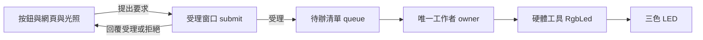
```mermaid
flowchart LR
    Inputs[按鈕與網頁與光照] -->|提出要求| Desk[受理窗口 submit]
    Desk -->|受理| Todo[待辦清單 queue]
    Todo --> Worker[唯一工作者 owner]
    Worker --> Tool[硬體工具 RgbLed]
    Tool --> Lamp[三色 LED]
    Desk -->|回覆受理或拒絕| Inputs
```

| 生活角色 | 程式對應 | 負責 | 不負責 |
|---|---|---|---|
| 提出要求的人 | button1_task、Web handler、light_sensor_task | 偵測輸入、提交命令 | 推進色碼或寫GPIO |
| 受理窗口 | LedService.submit | 判斷是否接單、給ID、預約警示 | 執行閃燈 |
| 待辦清單 | LedService._queue | 保留待執行命令 | 自己執行或決定政策 |
| 唯一工作者 | LedService.run→_step→_apply | 改正常狀態、推進警示、渲染 | 讀實體按鈕或ADC |
| 操作工具 | RgbLed.write | 色碼轉為三個Pin.value | 仲裁、排隊或保存警示 |

**submit和owner不是兩個LedService物件。** main只建立一個LedService，所有來源共用它。submit是同步方法，在哪個來源呼叫，就在該來源task的執行脈絡完成；run是獨立owner task。圖把「受理」與「執行」畫成不同角色，是為了分清工作，不代表兩個服務或額外task。

受理方法可以更新佇列、收據與預約旗標；「只有owner改狀態」特指LED正常色碼、效果執行與GPIO，不是禁止受理窗口管理它自己的資料。

**先確認：按鈕提出cycle時，LED是否已經換色？答案：還沒有。**

## 2. 分清楚命令、狀態、收據

| 資料 | 回答什麼問題？ | 範例 | 存在哪裡？ |
|---|---|---|---|
| 命令 | 想做什麼？ | cycle：前進一色 | _queue裡的tuple |
| 正常狀態 | 平常應顯示什麼？ | 色碼1、亮燈 | _desired_color、_desired_on |
| 警示狀態 | 現在暫時做什麼？ | 第2次紅亮 | _effect字典 |
| 收據receipt | 這筆要求處理到哪裡？ | ID10、accepted | _results，執行時也由queue/effect引用 |
| 實際輸出 | 此刻GPIO顯示什麼？ | 紅色4或全滅0 | RgbLed與GPIO |

警示中可能同時存在「正常色碼=藍1」和「實際輸出=紅4」；不矛盾，前者是完成後要回到的狀態。若把紅閃寫回正常色碼，按鈕循環與恢復就會混淆。

```python
# 提出要求，還不執行GPIO
reply = led_service.submit('cycle', 'button1')
# reply示例：{'id': 10, 'kind': 'cycle', 'source': 'button1',
#             'status': 'accepted', 'reason': None}
```

submit在內部建立receipt，把`('cycle', None, receipt)`放進_queue，也把**同一個receipt字典**放進_results。owner更新這個字典時，結果紀錄也隨之更新；來源得到的reply則是`dict(receipt)`副本，不會自動變更。要取得新結果，呼叫`result(10)`或結果API。

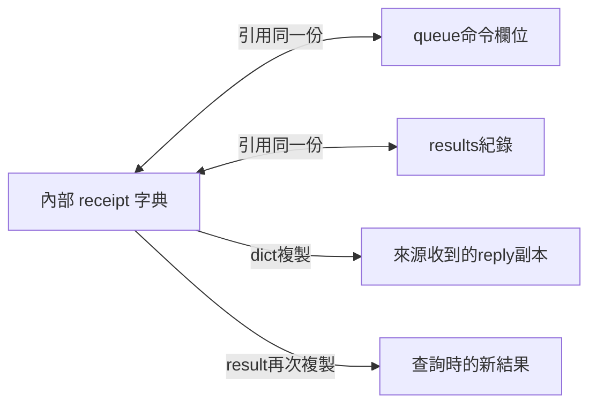
```mermaid
flowchart LR
    Receipt[內部 receipt 字典] <-->|引用同一份| QueueRef[queue命令欄位]
    Receipt <-->|引用同一份| ResultRef[results紀錄]
    Receipt -->|dict複製| ReplyCopy[來源收到的reply副本]
    Receipt -->|result再次複製| NewCopy[查詢時的新結果]
```

**accepted表示接單，不是已執行。** 警示可能在owner执行前到达，讓已接單的普通命令變成rejected。後面的案例會實際走過這件事。

取出命令時，queue中的tuple消失，但receipt仍由results引用，所以結果沒有一起消失。警示則暫時還由effect引用。results只保留最近16筆，舊紀錄被移除後，若其他地方也沒有引用，才可被回收；沒有把這些資料存入Flash。一般cycle的executing→executed之間没有await，查詢通常看不到那個短暫中間狀態；警示的executing則持續約3秒。

## 3. 開始前，main如何把角色接起來？

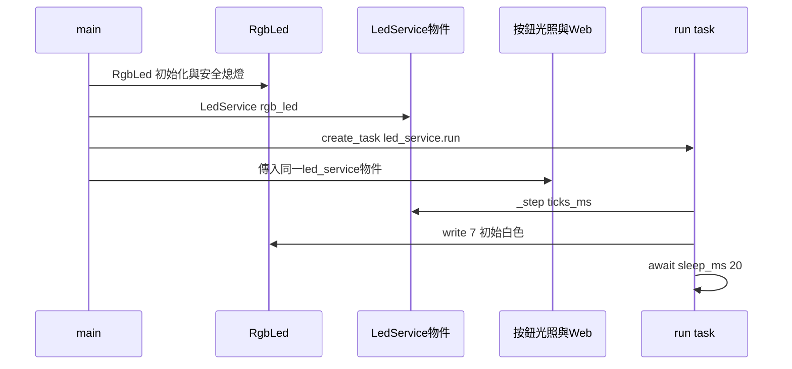
```mermaid
sequenceDiagram
    participant Main as main
    participant Hardware as RgbLed
    participant Service as LedService物件
    participant Sources as 按鈕光照與Web
    participant Owner as run task
    Main->>Hardware: RgbLed 初始化與安全熄燈
    Main->>Service: LedService rgb_led
    Main->>Owner: create_task led_service.run
    Main->>Sources: 傳入同一led_service物件
    Owner->>Service: _step ticks_ms
    Owner->>Hardware: write 7 初始白色
    Owner->>Owner: await sleep_ms 20
```

`main()`先await initialize_system取得硬體，再建立服務與owner task；物件裡有空_queue、空_results、reserved=false、desired_color=7、desired_on=true、effect=None。Web透過`web_server.led_service = led_service`取得同一物件；按鈕與光照透過任務參數取得。

create_task是安排owner執行，不代表當行指令立即寫GPIO。owner取得排程後才首次渲染白色；初始化期間的熄燈由硬體建構函式保障。從此各來源不再直接write。

## 4. 案例一：正常時按下實體按鈕1

**初始條件：**LED藍1、busy=false、queue空。目標是按一次變成綠2。

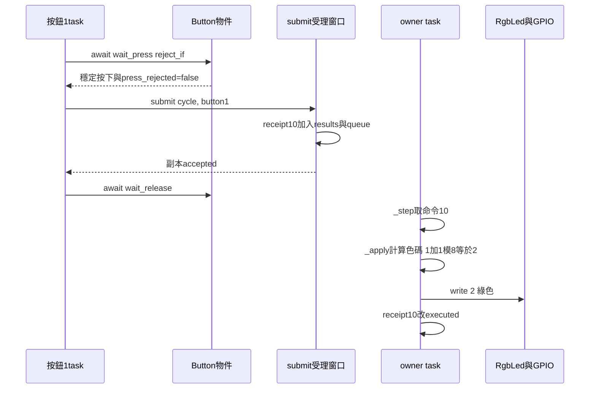
```mermaid
sequenceDiagram
    participant Button as 按鈕1task
    participant Input as Button物件
    participant Entry as submit受理窗口
    participant Owner as owner task
    participant Led as RgbLed與GPIO
    Button->>Input: await wait_press reject_if
    Input-->>Button: 穩定按下與press_rejected=false
    Button->>Entry: submit cycle, button1
    Entry->>Entry: receipt10加入results與queue
    Entry-->>Button: 副本accepted
    Button->>Input: await wait_release
    Owner->>Owner: _step取命令10
    Owner->>Owner: _apply計算色碼 1加1模8等於2
    Owner->>Led: write 2 綠色
    Owner->>Owner: receipt10改executed
```

| 步驟 | 哪個程式在執行？ | 呼叫／資料變化 | 是否碰GPIO？ |
|---|---|---|---|
| 1 | tasks.button1_task | await button1.wait_press，传reject_if=lambda:led_service.busy | 只讀按鈕GPIO |
| 2 | hardware.button | 最初按下與去彈跳檢查busy，正常時press_rejected=false | 只讀按鈕GPIO |
| 3 | button1_task→submit | kind='cycle'、source='button1'、value預設None | 不碰LED |
| 4 | submit | 建receipt10，queue=[cycle10]，回accepted副本 | 不碰LED |
| 5 | owner.run→_step | pop最早命令，_apply推進1→2，is_on=true | 尚未 |
| 6 | owner→RgbLed.write(2) | 2的三個位元為010，寫R=0、G=1、B=0 | 是，唯一owner |
| 7 | owner | receipt10.status='executed'，queue空 | 無新寫入 |

按鈕task等待放開，不是在等LED命令完成。owner与按鈕task都在各自await處讓出排程。图中的wait_release開始後owner執行是一種可能順序；按鈕也可能更早放開，不影響命令已經受理。

| 時點 | queue | 正常色碼 | LED輸出 | receipt10 |
|---|---|---|---|---|
| 按下前 | 空 | 1 | 藍1 | 尚未產生 |
| submit完成 | cycle10 | 1 | 藍1 | accepted |
| owner完成 | 空 | 2 | 綠2 | executed |

**關鍵問題：為何按鈕不自己算下一色？** 因為按鈕與Web若各讀改寫會把狀態責任分散。兩者都只提交cycle，owner便能依序推進兩次；即使同一輪處理，也不合併相對變更。

## 5. 案例二：光照低於閾值

**初始條件：**LED藍1、armed=true、busy=false、queue空；本次read取得ADC=900。

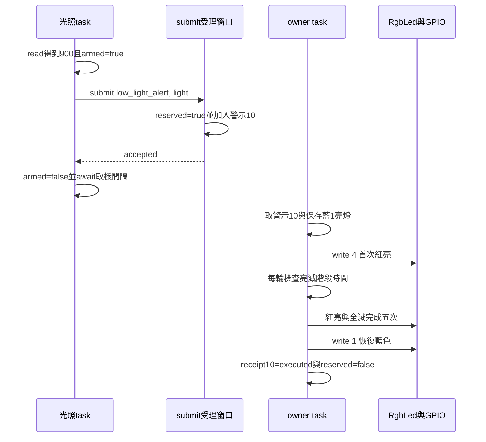
```mermaid
sequenceDiagram
    participant Light as 光照task
    participant Entry as submit受理窗口
    participant Owner as owner task
    participant Led as RgbLed與GPIO
    Light->>Light: read得到900且armed=true
    Light->>Entry: submit low_light_alert, light
    Entry->>Entry: reserved=true並加入警示10
    Entry-->>Light: accepted
    Light->>Light: armed=false並await取樣間隔
    Owner->>Owner: 取警示10與保存藍1亮燈
    Owner->>Led: write 4 首次紅亮
    Owner->>Owner: 每輪檢查亮滅階段時間
    Owner->>Led: 紅亮與全滅完成五次
    Owner->>Led: write 1 恢復藍色
    Owner->>Owner: receipt10=executed與reserved=false
```

1. `tasks.light_sensor_task`拿到brightness=900；啟用警示、非busy，且900<1000、armed=true，才提交`submit('low_light_alert', 'light')`。
2. submit先把_reserved設true，再放警示命令，回accepted。這時還沒開始閃，但新改色已被禁止。
3. 光照task看到受理成功才armed=false。這個變數留在該task的迴圈中，並不由owner管理。
4. owner的_apply在取警示時建立_effect，saved=(1,true)，phase_on=true、completed=0、started=本輪ticks_ms；300ms與五次來自config。
5. _step決定實際輸出紅4。正常色碼始終是1，所以警示亮滅不影響色碼循環。
6. 第五次熄滅階段也結束後，owner恢復saved，清除effect，write(1)成功，再標executed與reserved=false。

| 時點 | armed | busy | 正常色碼 | effect | 實際輸出 |
|---|---|---|---|---|---|
| 偵測前 | true | false | 1 | None | 藍1 |
| 警示已受理、尚未執行 | false | true | 1 | None | 藍1 |
| 第一次紅亮 | false | true | 1 | phase_on=true | 紅4 |
| 第一次熄滅 | false | true | 1 | phase_on=false | 全滅0 |
| 第五次熄滅結束並恢復 | false | false | 1 | None | 藍1 |

busy與effect不是同一個判斷：**busy涵蓋預約到恢復的整段時間；effect只在owner已開始警示後存在。** 這是避免受理後、執行前的空隙被改色插入的關鍵。

### 為何每20ms執行一次，卻是每300ms亮滅？

每20ms只是「回來檢查一次」，不是每輪切換。_step用ticks_diff(now, started)比較本階段時間，未滿300ms就保持輸出；滿了才切階段。硬體write也會忽略相同輸出，避免每轮重寫相同GPIO。

| 理想相對時間 | phase／completed | 輸出 |
|---|---|---|
| 0ms | 亮／0 | 第1次紅亮 |
| 300ms | 滅／0 | 全滅 |
| 600ms | 亮／1 | 第2次紅亮 |
| 2400ms | 亮／4 | 第5次紅亮 |
| 2700ms | 滅／4 | 全滅 |
| 3000ms | 第5輪完成，effect=None | 恢復藍色 |

這是理想推演；實際排程延遲會延長階段，每輪不補跳多個階段，避免肉眼少看到閃爍。

## 6. 案例三：按鈕與低光照「同時」發生

**先不要問誰贏，先問：警示受理當下，按鈕命令已执行，還是仍在queue？** 單一事件迴圈仍依序執行同步片段；人感覺同時按下、遮光，不代表兩段程式同一時刻寫GPIO。

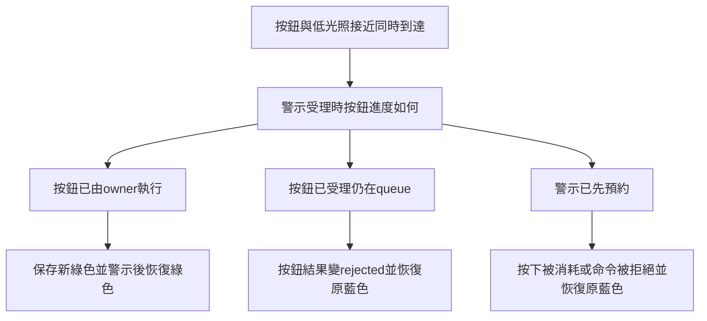
```mermaid
flowchart TD
    Arrival[按鈕與低光照接近同時到達] --> Check[警示受理時按鈕進度如何]
    Check --> Done[按鈕已由owner執行]
    Check --> Pending[按鈕已受理仍在queue]
    Check --> First[警示已先預約]
    Done --> SaveGreen[保存新綠色並警示後恢復綠色]
    Pending --> RejectPending[按鈕結果變rejected並恢復原藍色]
    First --> RejectNew[按下被消耗或命令被拒絕並恢復原藍色]
```

### 6A. 按鈕先完成，才受理警示

初始藍1。按鈕命令10已完成，因此警示11保存的是綠2；不能撤銷已執行的操作。

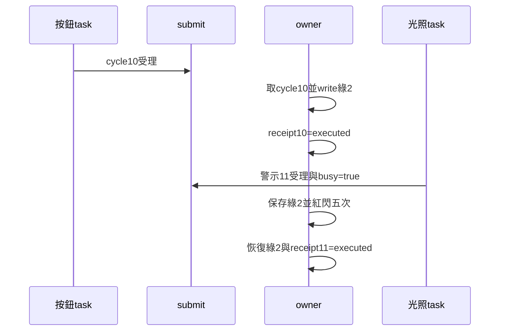
```mermaid
sequenceDiagram
    participant Button as 按鈕task
    participant Entry as submit
    participant Owner as owner
    participant Light as 光照task
    Button->>Entry: cycle10受理
    Owner->>Owner: 取cycle10並write綠2
    Owner->>Owner: receipt10=executed
    Light->>Entry: 警示11受理與busy=true
    Owner->>Owner: 保存綠2並紅閃五次
    Owner->>Owner: 恢復綠2與receipt11=executed
```

| 最終正常色碼／輸出 | 命令10 | 警示11 |
|---|---|---|
| 綠2 | executed | executed |

### 6B. 按鈕先受理，但owner尚未執行

這是最容易誤解的情況：**accepted之後仍可能rejected。** 此時正常色碼仍是藍1，並未變綠。

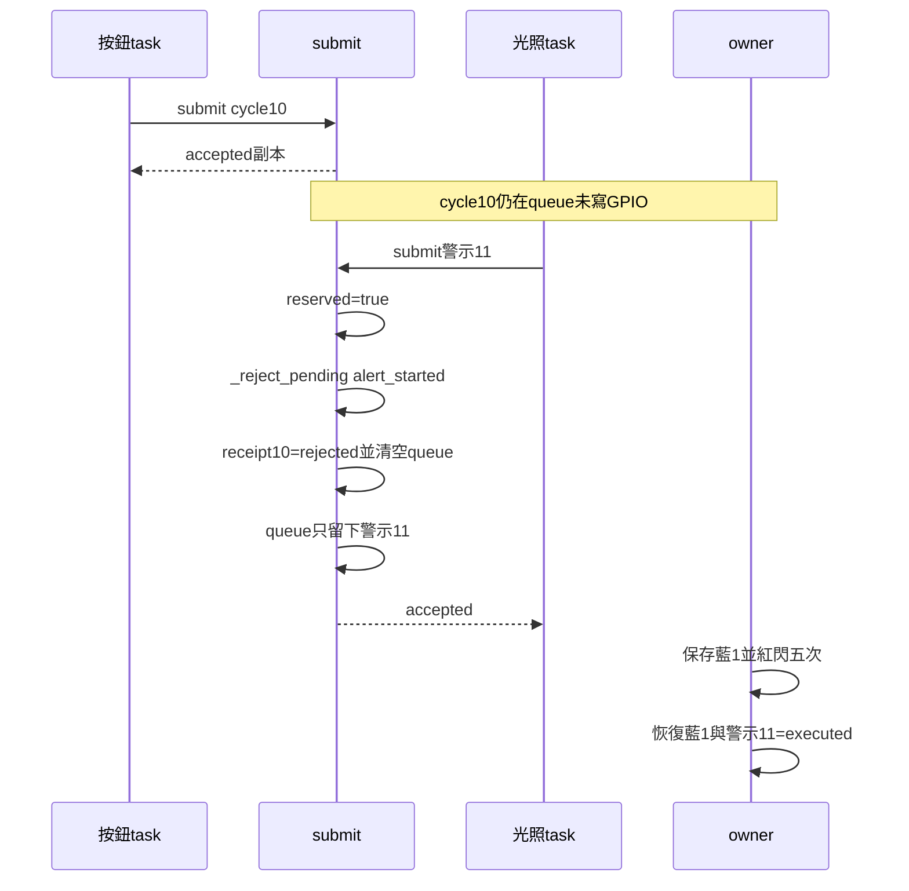
```mermaid
sequenceDiagram
    participant Button as 按鈕task
    participant Entry as submit
    participant Light as 光照task
    participant Owner as owner
    Button->>Entry: submit cycle10
    Entry-->>Button: accepted副本
    Note over Entry,Owner: cycle10仍在queue未寫GPIO
    Light->>Entry: submit警示11
    Entry->>Entry: reserved=true
    Entry->>Entry: _reject_pending alert_started
    Entry->>Entry: receipt10=rejected並清空queue
    Entry->>Entry: queue只留下警示11
    Entry-->>Light: accepted
    Owner->>Owner: 保存藍1並紅閃五次
    Owner->>Owner: 恢復藍1與警示11=executed
```

| 時點 | queue | 正常色碼 | 命令10的內部收據 |
|---|---|---|---|
| 按鈕受理後 | cycle10 | 1 | accepted |
| 警示受理後 | alert11 | 1 | rejected，reason=alert_started |
| 警示完成 | 空 | 1 | 保留拒絕結果，不补執行 |

按鈕先前拿到的reply副本仍寫accepted，不會自动變rejected；結果需用result(10)確認。若來源是Web，前端的命令結果輪詢就會顯示未完成與alert_started，而不誤稱已切色。

### 6C. 警示先受理，按鈕後來

submit受理警示時就busy=true。按鈕即使先於首次紅亮按下，也應拒絕。

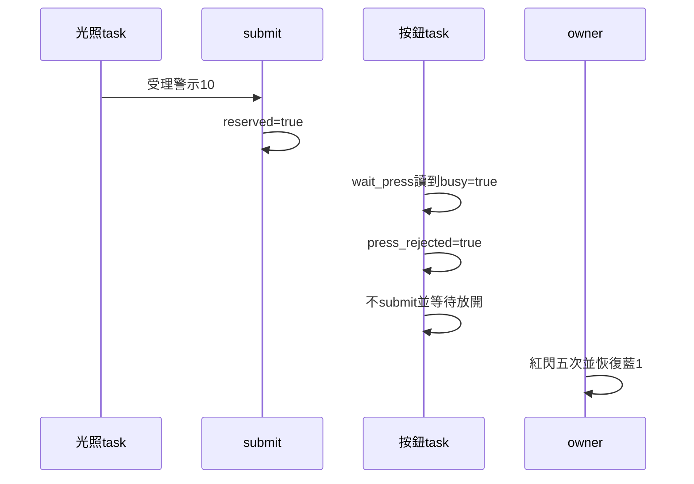
```mermaid
sequenceDiagram
    participant Light as 光照task
    participant Entry as submit
    participant Button as 按鈕task
    participant Owner as owner
    Light->>Entry: 受理警示10
    Entry->>Entry: reserved=true
    Button->>Button: wait_press讀到busy=true
    Button->>Button: press_rejected=true
    Button->>Button: 不submit並等待放開
    Owner->>Owner: 紅閃五次並恢復藍1
```

這條路徑沒有新的按鈕命令ID，因為來源已經消耗該次按下。如果是來源狀態檢查後警示才開始、來源又提交cycle，submit的最終busy檢查仍拒絕，回receipt.status=rejected、reason=busy。兩條拒絕路徑都不寫GPIO，也不排隊。

**課堂總結：同時到達不一定結果相同，但每個結果都可由受理與執行的先後順序解釋。**

## 7. 案例四：紅閃第三次時按下實體按鈕

**初始條件：**警示執行中、busy=true、正常狀態仍藍1，當下輸出可能紅4或全滅0。此案例目標是證明「不会插入綠色，也不延後補執行」。

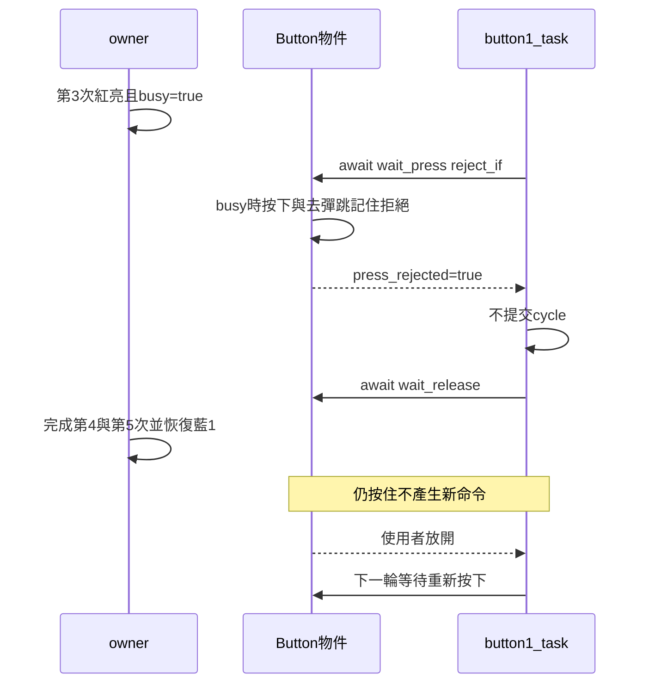
```mermaid
sequenceDiagram
    participant Owner as owner
    participant Input as Button物件
    participant Button as button1_task
    Owner->>Owner: 第3次紅亮且busy=true
    Button->>Input: await wait_press reject_if
    Input->>Input: busy時按下與去彈跳記住拒絕
    Input-->>Button: press_rejected=true
    Button->>Button: 不提交cycle
    Button->>Input: await wait_release
    Owner->>Owner: 完成第4與第5次並恢復藍1
    Note over Button,Input: 仍按住不產生新命令
    Input-->>Button: 使用者放開
    Button->>Input: 下一輪等待重新按下
```

1. `Button.wait_press(reject_if=lambda: led_service.busy)` 在初始低電位及去彈跳中檢查busy，曾遇到忙碌就記住press_rejected=true。
2. `button1_task`發現press_rejected，不呼叫submit，因此沒有按鈕命令、queue不新增資料、正常色碼不變。
3. 任務仍await wait_release消耗此次按下。即使一直按到警示結束，也不因busy=false就補提交。
4. 放開後再次按下，wait_press建立新的press_rejected判斷；若非busy，才提交新的cycle，owner把藍1變綠2。

| 階段 | 按鈕 | busy | 是否有新cycle | LED |
|---|---|---|---|---|
| 第3次紅閃 | 按下 | true | 沒有 | 繼續紅／滅 |
| 警示恢復 | 仍按住 | false | 沒有 | 藍1 |
| 放開 | 釋放 | false | 沒有 | 藍1 |
| 重新按下 | 新按下 | false | accepted，等待owner | 隨後綠2 |

去彈跳接近結束時警示剛好完成，也不會把旧按下当新操作，因為press_rejected保留了過程中曾忙碌的資訊。這是輸入生命週期政策，不是单靠owner佇列就能自動辦到。

## 8. 把同樣規則套到網頁按鈕

網頁按鈕停用是使用者提示，不是資源控制的保障。LED 狀態現採獨立快速輪詢，仍可能受網路或排程延遲影響；舊頁面或其他HTTP客戶端仍可能送出POST，後端submit的busy檢查才是權威。

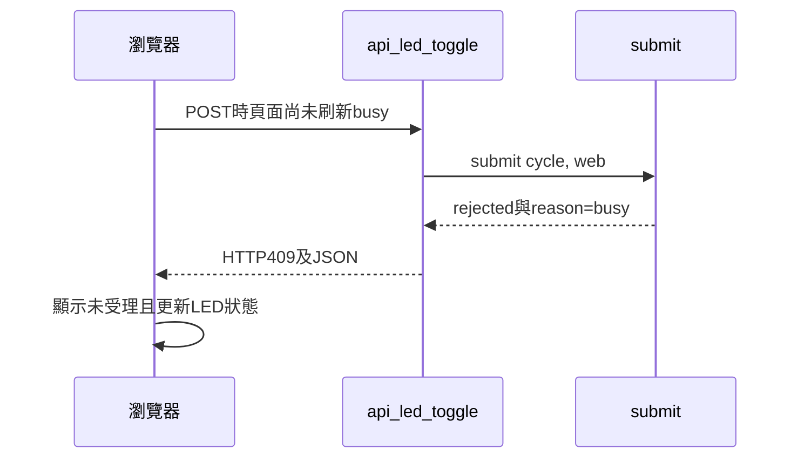
```mermaid
sequenceDiagram
    participant Browser as 瀏覽器
    participant Api as api_led_toggle
    participant Entry as submit
    Browser->>Api: POST時頁面尚未刷新busy
    Api->>Entry: submit cycle, web
    Entry-->>Api: rejected與reason=busy
    Api-->>Browser: HTTP409及JSON
    Browser->>Browser: 顯示未受理且更新LED狀態
```

正常時POST回202與ID，不等待owner完成。`index.html.toggleLED()`會查`GET /api/led/commands/ID`，區分executed、rejected、failed、cancelled；最近16筆之外回404，應顯示結果未知或過期，不應斷言命令沒有執行。

實體按鈕與網頁的共同點是只能提交cycle；差別是實體需要消耗按下／放開，Web需要HTTP受理狀態與結果查詢。兩者不能只用同一種前端停用方式解決。

> 閱讀版本提示：8A、8B說明快速通道的第一版；其中「單次查詢失敗立即停用」已由8C的有效期限判斷取代。分流與後端仲裁仍保留。

### 8A. 提示需要自己的快速資料通道

2026-10-07 使用者回報，實機紅閃開始約2秒後網頁才顯示警示、停用按鈕，隨即因警示已完成又顯示可操作。這表示畫面不是同步的控制狀態，不能因此推論後端允许插入改色。原網頁將LED顯示綁在每秒/api/data，且setInterval可能產生重疊請求；舊回應可能較晚抵達。這是已確認的程式風險，尚未量測本次2秒延遲各部分的比例。

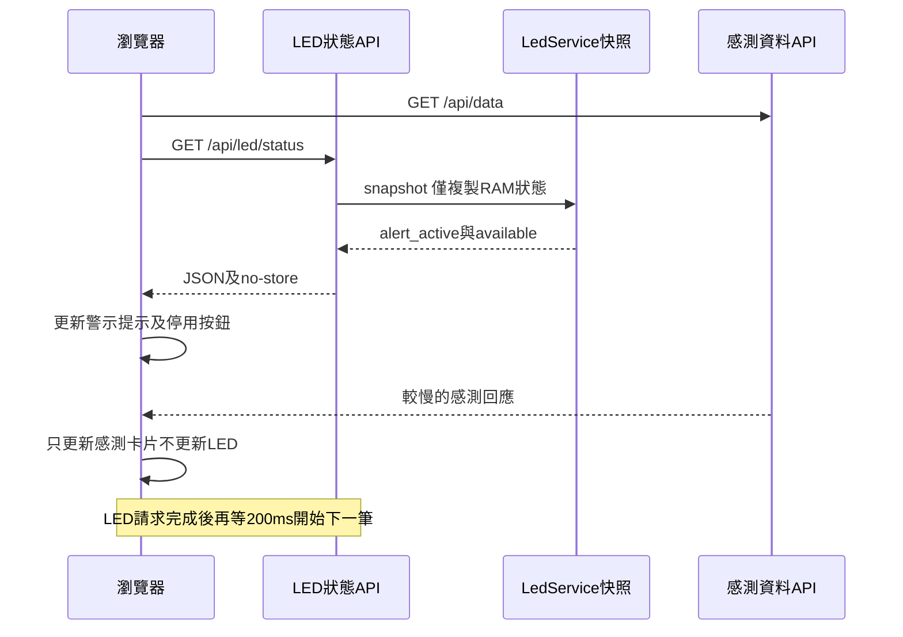
```mermaid
sequenceDiagram
    participant Browser as 瀏覽器
    participant FastApi as LED狀態API
    participant Owner as LedService快照
    participant DataApi as 感測資料API
    Browser->>DataApi: GET /api/data
    Browser->>FastApi: GET /api/led/status
    FastApi->>Owner: snapshot 僅複製RAM狀態
    Owner-->>FastApi: alert_active與available
    FastApi-->>Browser: JSON及no-store
    Browser->>Browser: 更新警示提示及停用按鈕
    DataApi-->>Browser: 較慢的感測回應
    Browser->>Browser: 只更新感測卡片不更新LED
    Note over Browser,FastApi: LED請求完成後再等200ms開始下一筆
```

- **快速端點：**web_server.api_led_status只呼叫led_service.snapshot，不讀ADC、DHT、RFID或GPIO；回Cache-Control:no-store。/api/data仍含LED副本供相容，但新前端不使用它更新LED。
- **前端分流：**pollLedStatus→updateLedStatus取得快速快照，完成後等200ms再取；pollSensorData→updateData完成後等1000ms再取，兩個通道分開運作。200ms不是保證反應上限，仍加上HTTP與排程時間。
- **不重疊：**LED一次只保有一個ledStatusRequest，多個呼叫共用該Promise；感測也有pending檢查。不用setInterval持續新增未完成請求，避免舊感測回應把新的LED提示覆蓋。
- **逾時：**LED狀態請求1秒未完成就Abort，顯示狀態未知並停用按鈕；Promise.race讓已逾時請求的晚到回應不再渲染。下一筆成功才恢復。沒有把未知當成可操作。
- **拒絕仍有效：**POST回409時立即顯示警示；命令提交與busy政策未改。切色結果查詢後改刷新快速LED通道，不等待整份感測資料。

這是較快的輪詢，並非server push，也不會提前預知尚未取得的狀態。若ESP32有同步耗時操作阻塞事件迴圈、WiFi延遲或瀏覽器背景節流，快速端點也會延遲；需另行量測，不宣稱本次已確認或修正所有根因。快照是取樣當下的資訊，畫面仍是最終一致而非與GPIO零延遲同步。

桌面測試以延遲的fetch驗證慢感測不擋LED、舊感測不重新啟用按鈕、單筆在途、逾時Abort、晚到回應忽略與恢复；實際Microdot路由測試確認狀態端點不調用ADC並回no-store。部署本次修正只需更新web_server.py與index.html，重啟ESP32重新載入HTML，再在瀏覽器強制重新整理。

### 8B. 為何這次改善有效：把控制提示與感測展示分開

2026-10-07 使用者重新部署後回報「現在的即時反應效果蠻好的」。這是實機使用感受的確認，沒有提供毫秒量測或多瀏覽器壓力測試；不要將它解讀為所有情況皆在200ms內完成。

**先從需求出發：**溫溼度卡片稍晚更新，通常不影響下一步操作；「現在能不能按LED按鈕」卻直接影響使用者的判斷。兩者需要的資料新鮮度不同，因此不應只能等待同一份回應。LED owner已經把busy狀態保存在RAM，畫面只需要查這份控制狀態，不需要為了知道busy而重新讀取感測器。

#### 前後架構比較

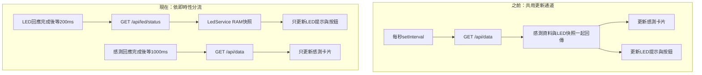
```mermaid
flowchart TD
    subgraph Before[之前：共用更新通道]
        OldTimer[每秒setInterval] --> OldFetch[GET /api/data]
        OldFetch --> Combined[感測資料與LED快照一起回傳]
        Combined --> OldCards[更新感測卡片]
        Combined --> OldButton[更新LED提示與按鈕]
    end
    subgraph After[現在：依即時性分流]
        FastPoll[LED回應完成後等200ms] --> FastFetch[GET /api/led/status]
        FastFetch --> Ram[LedService RAM快照]
        Ram --> NewButton[只更新LED提示與按鈕]
        SlowPoll[感測回應完成後等1000ms] --> SlowFetch[GET /api/data]
        SlowFetch --> NewCards[只更新感測卡片]
    end
```

| 比較項目 | 之前 | 現在 | 改良原因 |
|---|---|---|---|
| 更新頻率 | LED與感測一起每秒發起 | LED完成後200ms，感測完成後1000ms | 按鈕是否可操作需要更快提示 |
| LED資料來源 | 整份/api/data中的led副本 | /api/led/status的owner快照 | 控制提示不必等整份感測回應 |
| 發起下一筆的方式 | setInterval不等前一筆完成 | await完成後用setTimeout安排下一筆 | 避免慢回應時累積重疊請求 |
| LED畫面的寫入者 | 每筆感測回應都能更新 | 只有LED狀態通道更新，409亦可立即提示busy | 避免舊感測副本改寫新的控制提示 |
| 狀態取得失敗 | 感測失敗也影響LED提示 | LED自己逾時或失敗才將操作暫停 | 分開兩個通道的失敗影響 |
| 執行權限 | owner的submit檢查busy | 同樣由owner檢查busy | 快速提示改善操作感受，控制政策仍在後端 |

#### 之前為何容易顯示得太晚？

第一個等待是**輪詢的取樣間隔**。假設剛查完時還沒紅閃，隨後警示開始，頁面須等下一次查詢才可能得知。第二個等待是HTTP傳輸與伺服器處理；整份/api/data還包含其他資料處理，LED提示隨著整份回應抵達。這兩種等待相加，就可能看見警示時已接近結束。不能只因每秒發一次就認為每秒一定收到新畫面。

另一個風險是**回應順序與狀態新鮮度**。setInterval只負責定時發起，不保證前一筆已完成。例如先前查到「可操作」的回應延後抵達，就可能覆蓋稍後取得的「紅閃中」。這是舊設計允許發生的風險，並非已量測證實本次實機一定發生。即使沒有亂序，共用慢通道仍會拖延提示。

原先共用端點的優點是程式較短、請求較少，適合所有欄位更新需求接近、資料取得很快的簡單展示頁。當控制提示對時效更敏感時，這種耦合就成為缺點。

#### 用一次紅閃走過新流程

1. 光照task提交low_light_alert，LedService.submit先設預約旗標；從這一刻起busy成立，新的改色要求會被拒絕。owner之後按既有狀態機輸出紅閃，這次沒有改動此控制流程。
2. 瀏覽器pollLedStatus呼叫updateLedStatus。若已有ledStatusRequest，直接共用它，不另開第二筆；否則fetch GET /api/led/status。
3. web_server.api_led_status呼叫led_service.snapshot()，產生包含alert_active、available等欄位的新字典。JSON是取樣時的副本，沒有轉移GPIO控制權，也沒有改動owner。
4. updateLedStatus取得JSON，showLedStatus以alert_active顯示紅閃提示，並以ledRequestPending、available、alert_active決定disabled。這裡停用的是網頁LED控制按鈕；實體按鈕的拒絕仍由原有後端機制處理。
5. 同時，較慢的/api/data即使帶著舊led欄位抵達，updateData也只更新感測卡片，因此不能把LED提示改回可操作。
6. 紅閃結束、原色恢復後，下一份LED快照的alert_active變成false；若沒有在途改色命令且服務可用，畫面恢復可操作。不是由前端自行倒數推測紅閃結束。

**資料怎麼產生與消失？**owner的控制狀態長期存在RAM並隨執行改變；每次snapshot產生獨立副本，再序列化成HTTP JSON。瀏覽器解析成當次物件並把值寫入DOM，不保存快照歷史；物件無引用後可由垃圾回收釋放。在途Promise完成後清除引用與逾時計時器，再安排下一輪。若1秒未完成，AbortController要求中止請求，Promise.race結束本輪並停用按鈕；該輪晚到的資料不再進入showLedStatus。中止瀏覽器等待不等於取消ESP32上的LED命令。

#### 背後的觀念與以後的使用原則

這個設計運用**分離關注點、依時效分流、單筆在途與取樣快照**。畫面呈現的是最近一次成功取得的狀態，屬於最終一致；後端仍是權威，因此再快的查詢也不能取代submit檢查。畫面延遲包含「等待下一輪＋傳輸＋伺服器排程與處理＋瀏覽器渲染」，200ms只設定完成後的等待時間。

往後本專案優先採用這個方式呈現會影響操作的狀態：由掌管資源的服務提供輕量RAM快照，與一般感測展示分開輪詢；各通道一次只保有一筆請求，完成後排下一筆，使用no-store、逾時處理並明確顯示未知。一般卡片不回寫控制提示，操作結果另用命令ID查詢，控制許可仍由後端判定。

使用前提是後端已有可快速讀取的可信狀態、事件迴圈可正常讓出，且輪詢流量可接受。單頁LED約最多5次查詢每秒，多頁會相加；增加通道前應評估ESP32負載。若需捕捉非常短的事件，快照可能在兩次取樣間漏掉，應另外保存事件序號／紀錄；若需大量連線或更低延遲，再評估SSE／WebSocket。這些是替代方案的使用時機，本次沒有實作。同步阻塞或WiFi延遲仍可能拖慢所有通道，分流不會自動消除它們。

### 8C. 不把一次查詢失敗當成連線失效：狀態有效期限

使用者在重新整理瀏覽器後確認：不再頻繁出現連線失敗訊息並讓按鈕1瞬間失能。這是本次實機操作結果的回報；測試精確時間、持續時間與HTTP延遲數據未提供。已確認的是新版介面的改善，尚未證實偶發HTTP失敗的根因已消除。

#### 先區分三個問題

1. **值有沒有改變？**LED連續回報「可操作」，或者光照連續回報相同數字，都是合理情況。
2. **最近是否成功確認？**收到新的成功回應，即使值相同，也有新的確認時間。画面留著上一筆數字並不代表取得新資料。
3. **這次確認的是哪一種資料？**感測API成功證明近期仍能通訊，但不能保證LED目前不是紅閃；只有LED狀態回應才能更新LED的有效期限。

| 機制 | 快速通道第一版 | 目前版本 |
|---|---|---|
| LED單次查詢失敗 | 立即停用並顯示錯誤 | 保留未過期的最近LED快照 |
| 下一筆成功 | 立即清除錯誤，容易短暫閃動 | 更新確認時間並依快照呈現 |
| 光照API成功 | 不參與LED連線判斷 | 更新連線健康時間，不更新LED時間 |
| 何時因未知停用 | 每次失敗就停用 | LED超過有效期限仍未確認 |
| LED明確紅閃／不可用 | 立即停用 | 同樣立即停用 |

#### 組成與程式位置

這一層在index.html，並不增加另一個GPIO控制者。updateLedStatus取得LED快照，updateData取得感測資料；兩者成功時都呼叫connectionSucceeded，而只有showLedStatus保存LED快照及其確認時間。

| 名稱 | 是什麼／怎麼產生 | 使用目的與消失方式 |
|---|---|---|
| lastLedSnapshot | showLedStatus複製成功的LED資料 | renderLedStatus判斷available與alert_active；下一筆覆蓋，頁面重載清除 |
| lastLedSuccessAt | 成功確認LED時的performance.now() | 計算LED資料年齡，值相同仍更新；重載回到null |
| lastConnectionSuccessAt | 兩種資料API成功時的performance.now() | 區分LED通道異常與連線無法確認；不延長LED期限 |
| STATUS_VALID_MS | 目前5000ms | 容忍短暫失敗的有效期限，須依需求與實測調整 |
| monitorLedFreshness | 每200ms呼叫renderLedStatus | 即使HTTP卡住也能檢查過期；不是另一條HTTP輪詢 |
| ledFailureCount／lastLedFailure | 失敗時加計數並保存最新原因與時間 | 成功歸零連續失敗數，保留最後錯誤；只保留一筆不累積歷史 |

performance.now是瀏覽器單調時間，用於經過時間，不是ESP32偵測日期，也不需要兩端時鐘同步。這裡量的是「距離最近收到成功回應多久」，不是保證後端快照的絕對產生時間；HTTP仍可能延遲。有效條件為年齡小於5000ms，達到5000ms便過期，監視器在下一次排程時呈現。

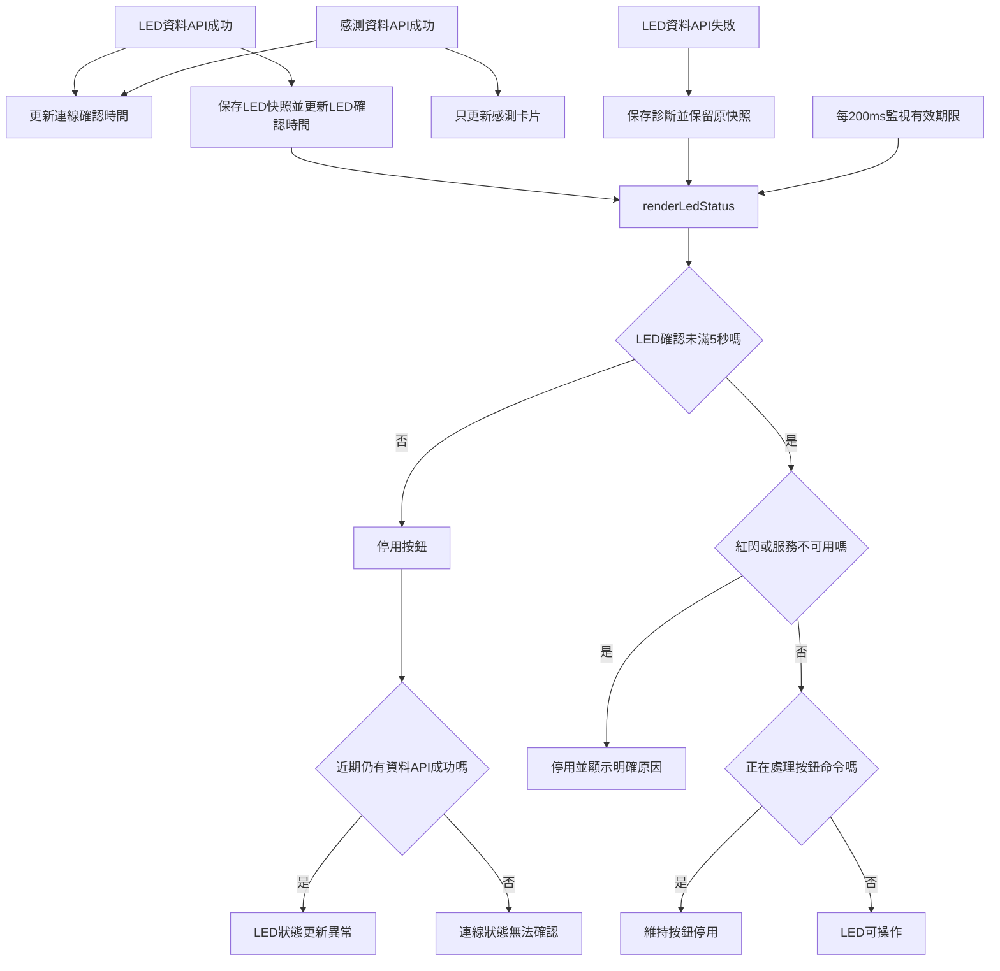
```mermaid
flowchart TD
    LedOk[LED資料API成功] --> Conn[更新連線確認時間]
    LedOk --> Save[保存LED快照並更新LED確認時間]
    SensorOk[感測資料API成功] --> Conn
    SensorOk --> Cards[只更新感測卡片]
    Failure[LED資料API失敗] --> Record[保存診斷並保留原快照]
    Save --> Render[renderLedStatus]
    Record --> Render
    Watch[每200ms監視有效期限] --> Render
    Render --> Fresh{LED確認未滿5秒嗎}
    Fresh -->|否| Disable[停用按鈕]
    Disable --> Health{近期仍有資料API成功嗎}
    Health -->|是| LedError[LED狀態更新異常]
    Health -->|否| ConnError[連線狀態無法確認]
    Fresh -->|是| State{紅閃或服務不可用嗎}
    State -->|是| Known[停用並顯示明確原因]
    State -->|否| Pending{正在處理按鈕命令嗎}
    Pending -->|是| Hold[維持按鈕停用]
    Pending -->|否| Ready[LED可操作]
```

#### 案例：光照正常，但LED查詢偶爾逾時

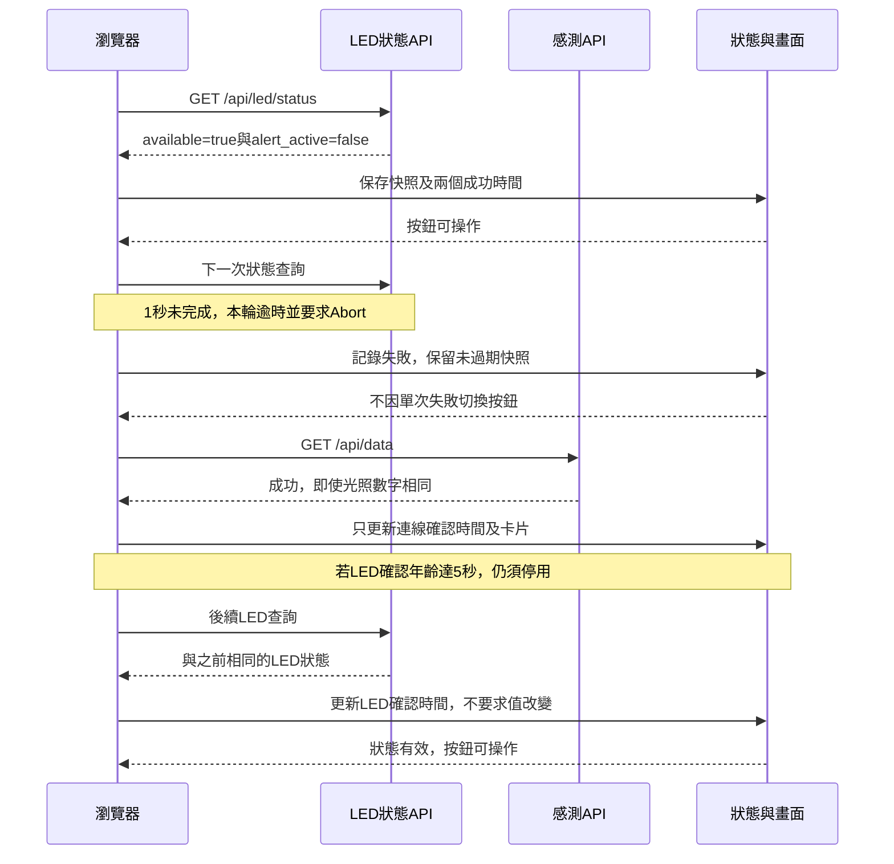
```mermaid
sequenceDiagram
    participant Browser as 瀏覽器
    participant LedApi as LED狀態API
    participant DataApi as 感測API
    participant View as 狀態與畫面
    Browser->>LedApi: GET /api/led/status
    LedApi-->>Browser: available=true與alert_active=false
    Browser->>View: 保存快照及兩個成功時間
    View-->>Browser: 按鈕可操作
    Browser->>LedApi: 下一次狀態查詢
    Note over Browser,LedApi: 1秒未完成，本輪逾時並要求Abort
    Browser->>View: 記錄失敗，保留未過期快照
    View-->>Browser: 不因單次失敗切換按鈕
    Browser->>DataApi: GET /api/data
    DataApi-->>Browser: 成功，即使光照數字相同
    Browser->>View: 只更新連線確認時間及卡片
    Note over Browser,View: 若LED確認年齡達5秒，仍須停用
    Browser->>LedApi: 後續LED查詢
    LedApi-->>Browser: 與之前相同的LED狀態
    Browser->>View: 更新LED確認時間，不要求值改變
    View-->>Browser: 狀態有效，按鈕可操作
```

用假設時間走一次：t=0收到可操作快照，t=1.2秒某次查詢逾時，LED年齡還不到5秒，畫面不跳動。t=3秒光照成功，連線確認時間更新，但LED確認仍是t=0。若一直沒有LED成功，t=5秒起監視器停用並顯示「LED狀態更新異常」；若後來兩條通道都超過5秒未成功，則顯示「連線狀態無法確認」。收到相同的可操作LED快照就重新確認有效並恢復，完全不需要顏色或光照值改變。這是示例時間，不是實機量測。

#### 安全性、限制與診斷

保留5秒內快照可能暫時顯示過去的可操作狀態；若紅閃剛開始而前端尚未得知，使用者仍可能送出改色要求。後端submit檢查busy並回409，前端據此顯示紅閃，因此控制權沒有交給這個有效期限。若已知紅閃中，查詢失敗也不會自行推算閃完而開放按鈕；必須取得新的成功狀態。

LED資料成功代表快照確認，POST回409則是後端明确拒絕的控制證據；showLedStatus同樣呈現busy。感測通道中的led副本仍不使用，避免重回舊回應覆蓋風險。逾時Abort與Promise.race仍保留，晚到回應不渲染。

瀏覽器開發者工具Console可執行getLedDiagnostics()，查看failureCount、lastFailure、ledAgeMs與connectionAgeMs。這是RAM診斷，不是永久事件日誌；重載頁面就清除。連線健康只表示近期能成功通訊，不承諾此刻每一個端點都能回應。

**適用前提：**能容忍短時間使用最近狀態，且後端每次操作都驗證權限／busy。對不可容忍舊狀態的操作，應縮短期限或採更嚴格失敗政策，不能直接套用5秒。200ms監視與HTTP逾時也受瀏覽器排程影響，背景頁面可能延後。

#### 部署與實測記錄

新版只改index.html，web_server.py須已具有/api/led/status。伺服器啟動時讀入HTML到RAM，因此上傳後應重啟ESP32，再以Ctrl+F5強制刷新瀏覽器。只上傳檔案不代表現有頁面已執行新程式。

比較基線f6b8e53保存「單次失敗立即停用」，5f3807c實作有效期限；ab5465f另調整PIR輸出，與這項判斷無關。使用者最初只上傳HTML仍見舊現象，後於瀏覽器重新整理後回報不再發生瞬間失能；不能因此推定最初所有失敗都由網路造成。先前20個Python與2組JavaScript桌面測試通過，新狀態測試包含短暫失敗、LED過期但感測成功、整體連線過期與相同快照恢復。

給學生的檢查題：光照一直成功且LED超過5秒未更新，按鈕該不該可操作？答案是不該，因為「能連上ESP32」與「能確認LED可操作」是兩件不同的事。

## 9. 閃完之後再遮光：還有一個獨立的開關

> **busy=false表示LED可操作；armed=true才表示光照任務允許再發警示。兩者不是同一件事。**

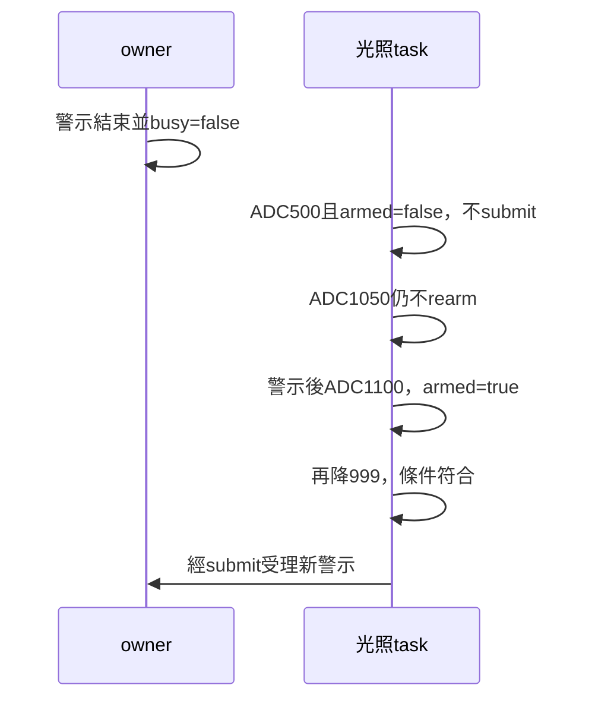
```mermaid
sequenceDiagram
    participant Owner as owner
    participant Light as 光照task
    Owner->>Owner: 警示結束並busy=false
    Light->>Light: ADC500且armed=false，不submit
    Light->>Light: ADC1050仍不rearm
    Light->>Light: 警示後ADC1100，armed=true
    Light->>Light: 再降999，條件符合
    Light->>Owner: 經submit受理新警示
```

圖中最後一箭頭代表要求送到owner的命令入口，不是直接呼叫GPIO。busy歸LedService管理，armed是light_sensor_task局部變數；解除警示不會替光照任務重設armed。警示期間短暫變亮也不算rearm，必須完成後再取樣到1100或以上。

## 10. 課堂演練與自我檢查

先不看程式，讓學生用紙卡代表cycle10、alert11和queue，按案例順序移動卡片。把「藍1」「busy」「armed」「receipt狀態」分開記錄，避免把不同資料混成一个LED變數。再依第4～9節圖逐一指向實際函式。

| 問題 | 核對答案 |
|---|---|
| submit accepted會立即換色嗎？ | 不會，只有owner執行才寫GPIO |
| 警示已受理但effect=None，可以切色嗎？ | 不可以，reserved已封鎖 |
| 藍1正在紅閃，正常色碼要改4嗎？ | 不改，4只作暫時輸出 |
| 按鈕accepted又變rejected，是錯誤嗎？ | 警示在執行前到達可依政策拒絕，是可解釋結果 |
| 按住到警示結束會換色嗎？ | 不會，必須放開重按 |
| 閃完又遮光為何沒再閃？ | armed還未由警示後ADC>=1100重新允許 |
| 哪裡能看到最終命令結果？ | result(ID)或GET命令結果API，而非旧reply副本 |

实機操作先觀察普通切色與低光警示，再做警示中按住與1100解除。案例6的精細交錯需要序列埠命令ID／結果配合，不能僅用肉眼宣稱已觀察到某個排程順序。後續如需課堂可控注入，可另設測試模式；本次不改程式或新增注入介面。

## 附錄：程式規格、仲裁理論與部署參考

下面保留較完整的架構與欄位規格。先完成案例，再用它作查表資料，不必在第一輪一次講完。

### A1. 問題分成四層

| 層次 | 問題 | 本版解法 |
|---|---|---|
| 一致性 | 讀、計算、寫入交錯會否遺失更新？ | 正常色碼只由 owner 推進；同步階段沒有 await |
| 所有權 | 誰能操作 GPIO？ | 初始化安全熄燈後，只有 LedService.run 的控制流程與 finally |
| 仲裁 | 多個要求要聽誰的？ | 一般命令 FIFO；警示立即預約、拒絕未執行及新改色；關機優先 |
| 效果執行 | 紅閃五次如何按時間推進？ | frame 狀態機，不阻塞其他 task |

critical section 描述一致性保障，單一 owner 是責任分配，仲裁政策回答誰先／拒絕誰；三者不是互相排斥的理論。將方法放在同一類別並不保證只由一個 task 執行。此版把硬體所有權集中在唯一 task，來源不計算或寫入色碼。

非同步 for + await 本身不阻塞整個事件迴圈，也可取消；選 frame 狀態機是為了把受理、仲裁、時間推進與狀態查詢放在一起，不是修正其「不能中斷」。本實驗不以解決先前尚待觀測的卡鈍為目的，也不宣稱已改善效能。

### A2. 要素與互動

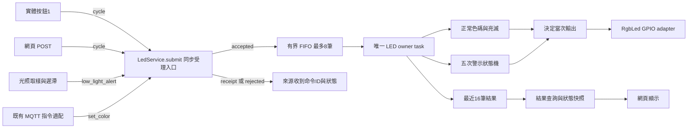
```mermaid
flowchart LR
    Button[實體按鈕1] -->|cycle| Entry[LedService.submit 同步受理入口]
    Web[網頁 POST] -->|cycle| Entry
    Light[光照取樣與遲滯] -->|low_light_alert| Entry
    Mqtt[既有 MQTT 指令適配] -->|set_color| Entry
    Entry -->|accepted| Queue[有界 FIFO 最多8筆]
    Entry -->|receipt 或 rejected| Reply[來源收到命令ID與狀態]
    Queue --> Owner[唯一 LED owner task]
    Owner --> Normal[正常色碼與亮滅]
    Owner --> Effect[五次警示狀態機]
    Normal --> Render[決定當次輸出]
    Effect --> Render
    Render --> Hardware[RgbLed GPIO adapter]
    Owner --> Results[最近16筆結果]
    Results --> Api[結果查詢與狀態快照]
    Api --> Browser[網頁顯示]
```

核心三個來源是按鈕、Web、光照；原本 MQTT 改色分支也改為提交命令，避免留下第四個直接寫入入口。本次未改 MQTT callback 接線，也未進行 broker 端到端測試，不能因适配分支存在而宣稱 MQTT 指令已實機驗證。

#### 對照實作檔案

| 檔案／函式 | 工作 |
|---|---|
| main.main | 建立 LedService、create_task(run)，注入 Web 並傳給生產者 |
| tasks.button1_task | 讀按鈕、去彈跳、提交 cycle，消耗被拒絕的按下至放開 |
| tasks.light_sensor_task | 50 ms 取樣，管理 armed 與1000／1100遲滯，提交警示 |
| services.led_service.LedService.submit | 同步檢查命令、忙碌、停止、容量，建立 receipt，不碰GPIO |
| LedService.run / _step / _apply | 唯一 owner，每輪最多4筆命令，推進效果並渲染 |
| hardware.led.RgbLed.write | 色碼位元轉三個GPIO，只在輸出改變時寫入 |
| web_server.api_led_toggle | 受理後回202，不等待整段效果或假稱已執行 |
| web_server.api_led_command_result | 依ID查目前命令結果 |

生產者可以讀 busy 或唯讀 snapshot 以提示使用者，但不能讀改寫 desired color。同步 submit 會管理 queue、receipt 與預約旗標，這是受理控制面的操作；GPIO、正常狀態與效果執行仍只由 owner 更新。所有呼叫前提為同一個 uasyncio 事件迴圈，不可從 IRQ／執行緒直接操作這個清單佇列。

### A3. 命令種類與仲裁表

| 命令 | 參數 | 語義 |
|---|---|---|
| cycle | source=button1/web | 相對變更，不冪等；兩次必須推進兩色，不能合併 |
| set_color | value=0～7、source=mqtt | 絕對設定；目前也以FIFO處理，不另合併 |
| low_light_alert | source=light | 有時長警示；次數／亮滅時間從config取得 |

| 目前狀態／情況 | 新要求 | 結果 |
|---|---|---|
| 正常、有容量 | cycle或set_color | accepted，FIFO等owner執行 |
| 正常、普通佇列滿 | 改色 | rejected / queue_full；不靜默丟失 |
| 正常、有未執行改色 | 光照警示 | 預約警示，舊改色receipt改為rejected / alert_started，清除舊佇列 |
| 警示已受理或執行中 | 改色或警示 | rejected / busy，不排隊、不改正常狀態 |
| 已停止 | 任意命令 | rejected / stopped |
| 任意狀態 | request_stop | 停止受理，拒絕待處理，owner清理熄燈 |

警示優先於尚未執行的一般命令，不能撤銷先前已執行的改色。這是一條明确政策，不是通用數字優先權框架。只預約一個警示，所以普通佇列滿也能受理警示，先拒絕普通待處理，沒有額外成長的警示佇列。

### A4. 受理到完成：不能把202當成功執行

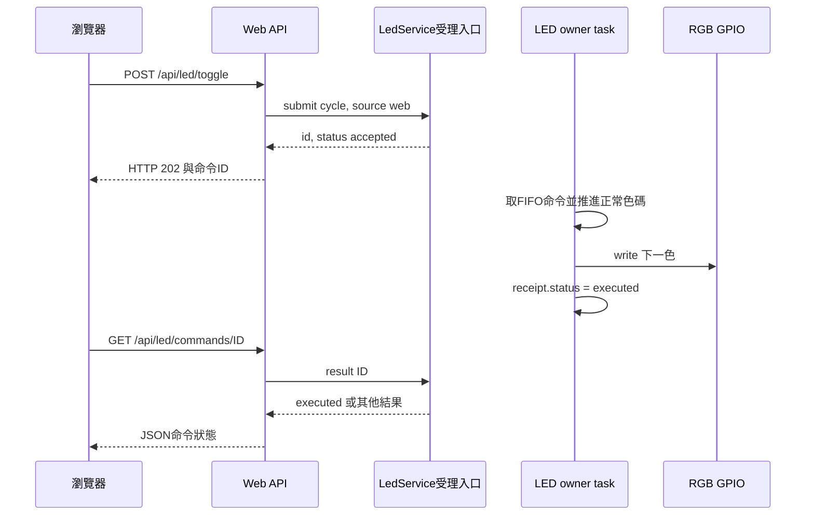
```mermaid
sequenceDiagram
    participant Browser as 瀏覽器
    participant Api as Web API
    participant Service as LedService受理入口
    participant Owner as LED owner task
    participant Pins as RGB GPIO
    Browser->>Api: POST /api/led/toggle
    Api->>Service: submit cycle, source web
    Service-->>Api: id, status accepted
    Api-->>Browser: HTTP 202 與命令ID
    Owner->>Owner: 取FIFO命令並推進正常色碼
    Owner->>Pins: write 下一色
    Owner->>Owner: receipt.status = executed
    Browser->>Api: GET /api/led/commands/ID
    Api->>Service: result ID
    Service-->>Api: executed 或其他結果
    Api-->>Browser: JSON命令狀態
```

receipt 為字典：id、kind、source、status、reason。id在此次RAM服務內遞增，重啟重置；POST立即回的字典是副本，不會自動變成完成結果。owner更新內部receipt，客戶端再查詢。網頁最多輪詢15次、每次等待50 ms，逾時顯示尚未取得結果，不稱執行失敗；斷線亦顯示結果未知。

| HTTP／狀態 | 意義 |
|---|---|
| POST 202 accepted | 已受理，尚未執行；可能後續因警示被拒絕 |
| POST 409 rejected/busy | 警示期間立即拒絕 |
| POST 429 rejected/queue_full | 佇列已滿，來源可明確提示 |
| POST 503 | 服務未建立或停止 |
| 結果 accepted / executing | 等候或執行中 |
| 結果 executed | 軟體輸出已完成，不保證硬體實際亮燈 |
| 結果 rejected / failed / cancelled | 分別為政策拒絕、執行錯誤、停止中止 |
| 查詢404 | 最近16筆紀錄之外或未知ID，不代表從未執行 |

快取與佇列都有界，不寫Flash、不提供完整歷史。反覆拒絕的請求也可能把旧結果移出最近16筆；正在執行的命令仍保有內部receipt，但查詢可能已過期。這是小型教學系統的記憶體取捨，需長期歷史應另設儲存。

### A5. 警示競爭時機與狀態機

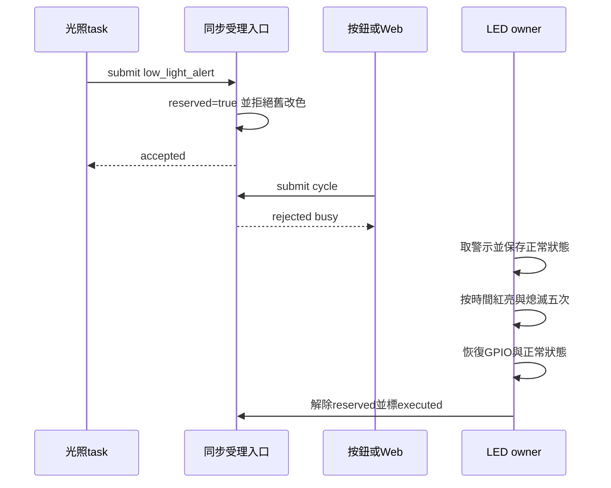
```mermaid
sequenceDiagram
    participant Light as 光照task
    participant Service as 同步受理入口
    participant Button as 按鈕或Web
    participant Owner as LED owner
    Light->>Service: submit low_light_alert
    Service->>Service: reserved=true 並拒絕舊改色
    Service-->>Light: accepted
    Button->>Service: submit cycle
    Service-->>Button: rejected busy
    Owner->>Owner: 取警示並保存正常狀態
    Owner->>Owner: 按時間紅亮與熄滅五次
    Owner->>Owner: 恢復GPIO與正常狀態
    Owner->>Service: 解除reserved並標executed
```

reserved在submit受理警示時就設true，沒有await，所以owner尚未取得排程也已拒絕新改色。只靠owner執行時才設busy會留下這個競爭窗口。警示开始會清除仍未執行的普通命令，且receipt留下拒絕原因，不會警示後補執行。

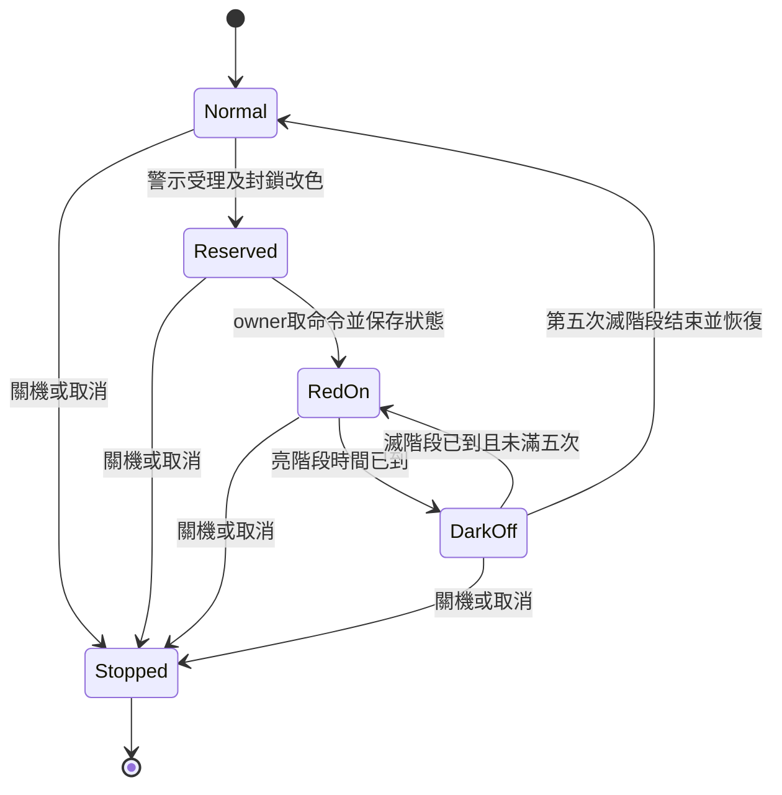
```mermaid
stateDiagram-v2
    [*] --> Normal
    Normal --> Reserved: 警示受理及封鎖改色
    Reserved --> RedOn: owner取命令並保存狀態
    RedOn --> DarkOff: 亮階段時間已到
    DarkOff --> RedOn: 滅階段已到且未滿五次
    DarkOff --> Normal: 第五次滅階段结束並恢復
    Normal --> Stopped: 關機或取消
    Reserved --> Stopped: 關機或取消
    RedOn --> Stopped: 關機或取消
    DarkOff --> Stopped: 關機或取消
    Stopped --> [*]
```

效果儲存phase_on、completed、started、count、on_ms、off_ms、saved、receipt。正常色碼／亮滅不被紅亮與全滅改寫，結束才恢復保存值。相對時間以time.ticks_ms/ticks_diff計算，支援tick回繞；不是從uasyncio匯入ticks_ms，也不直接減計數器。

owner每20 ms讓出排程；每輪最多4筆命令，避免一直drain而餓死效果。每輪最多推進一個亮滅階段，發生延遲時延長該階段，不快速補跳多個階段造成肉眼看不到五次。設定300 ms不代表硬體精準時間，仍受整個迴圈其他工作影響。

停止由request_stop在控制面設定停止、拒絕待處理；owner在下一次排程進入finally、標記未完成效果cancelled、寫0並發出stopped Event。main等待stopped後再結束喇叭清理。GPIO寫入錯誤會標failed並讓owner退出；若硬體連熄燈都失敗，軟體不能保證安全輸出。

### A6. 重新允許觸發：仍須先回到1100

> **警示完成不等於armed=true。警示結束後先取樣到ADC ≥ 1100，再降至ADC < 1000，才再次受理警示。**

armed仍在光照生產者內管理，50 ms取樣；警示busy期間不rearm。500→1050→500不重播；500→1100→999才重播。開機已暗仍觸發一次。兩個閾值形成遲滯，沒有新增冷卻時間或連續三次確認，避免暗中改變已確認功能。

### A7. 與上一版比較：是否更容易理解？

| 面向 | 重構前 | 此分支 |
|---|---|---|
| 操作來源 | 呼叫具有忙碌檢查的RgbLed方法 | 只提交cycle／警示／set_color |
| 硬體層 | 包含正常狀態、token、快照、關機與GPIO | 只把索引轉為GPIO，重複輸出不寫 |
| 效果 | tasks警示協程＋token控制 | owner狀態機＋reserved受理旗標 |
| Web回應 | 同步改色後回200 | 回202，依ID取得實際結果 |
| 拒絕政策 | 分散在控制器與各入口 | submit／owner集中，來源處理receipt |
| 額外複雜度 | 少量狀態，適合效果單純 | 佇列容量、結果保存、frame推進、HTTP查詢 |

可讀性初步評估：來源與硬體層更簡單，責任較集中；整體程式不一定更短，尤其加入受理結果與查詢是新增複雜度。先讀submit→_apply→_step→run較容易理解；狀態機對初學者需要講解時間與階段。需實際教學及實機使用後再決定是否保留此架構，不能僅依測試宣稱更穩定。

不採用普通await Lock，因警示期间需拒絕而非等待；不接受背景改色，因完成後要恢復原狀；不加入通用優先權／搶占框架，因目前規則只有警示與關機。Event本版只用於owner停止通知，owner不靠busy Event搶GPIO，也沒有多writer token交接。

### A8. 部署與驗收

上傳main.py、tasks.py、web_server.py、index.html、hardware/led.py，以及新增services目錄（__init__.py、led_service.py）。保留已正常的hardware/button.py、sensors.py、PIR／RFID模組與私人config.py；LIGHT_ALERT_*使用現有值，這次不用新增配置。重啟ESP32載入HTML快取，確認序列埠印出LED Owner啟動。

有意的差異：安全初始化先熄燈，白色7由owner在系統初始化完成後首次渲染，所以WiFi／NTP／MQTT初始化等待期間不再顯示白色。效果約20 ms frame延遲；Web既有URL維持，但成功受理從200改202。這些不是硬體故障。

驗收項目：

1. 正常時實體／Web各按一次，色碼前進兩次，循環0～7。
2. 暗觸發完整五次，原色或原先0熄滅恢復；期間按鈕不插入，按住直到結束不补執行。
3. 已受理但尚未執行的改色遇到警示，網頁顯示拒絕而不是執行成功。
4. 持續暗不重播，回亮到1100再暗才重播；閾值附近波動與警示期間亮暗切換不排隊。
5. 刷RFID、PIR音樂、Web刷新正常；中斷後熄燈；重啟結果紀錄與ID重置。

桌面20個Python測試通過，涵蓋命令FIFO、兩次cycle不合併、警示預約競爭、清除待執行改色、五次輸出／恢復、時間回繞、延遲不跳階段、有界記錄／佇列、取消／關機、GPIO失敗、Web202／409／結果查詢與既有PIR／RFID回歸。另以固定隨機種子進行1000輪混合命令、再200輪收尾，確認記憶體上限與效果結束；並驗證main任務錯誤後等待owner熄燈。網頁JavaScript模擬測試通過受理／執行／後續拒絕與原功能。非ESP32實機、broker、真實瀏覽器布局或實機壓力驗證。

本講義全部20張Mermaid圖已使用11.13.0實際解析，20/20通過；未做Typora／VS Code視覺布局驗證，解析不等於所有編輯器的視覺布局一致。

### A9. 比較與回復

```powershell
git diff main...refactor/led-single-owner -- hardware/led.py tasks.py services/led_service.py
git switch main
```

main保存實驗前程式與講義補充，本分支尚未推送。回復時必須將main版本的hardware/led.py與main/tasks/web_server/index一起部署，不能混用兩版介面；額外services檔案可保留但舊main不會匯入。私人config.py未改，保留WiFi及已確認的警示參數。
