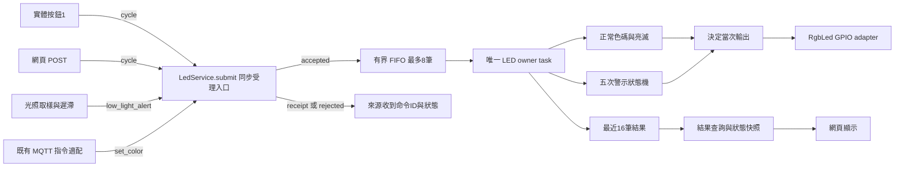
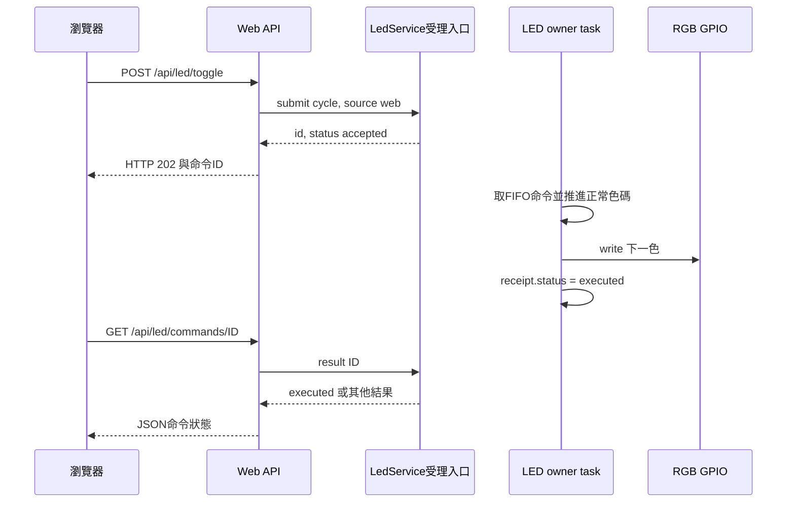
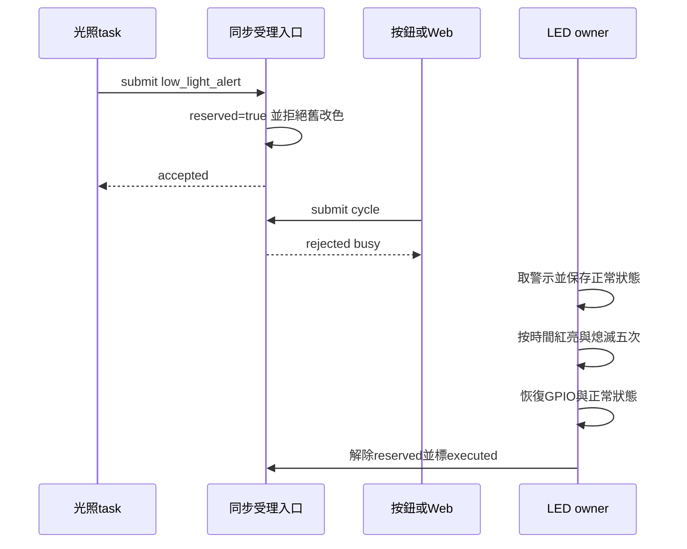
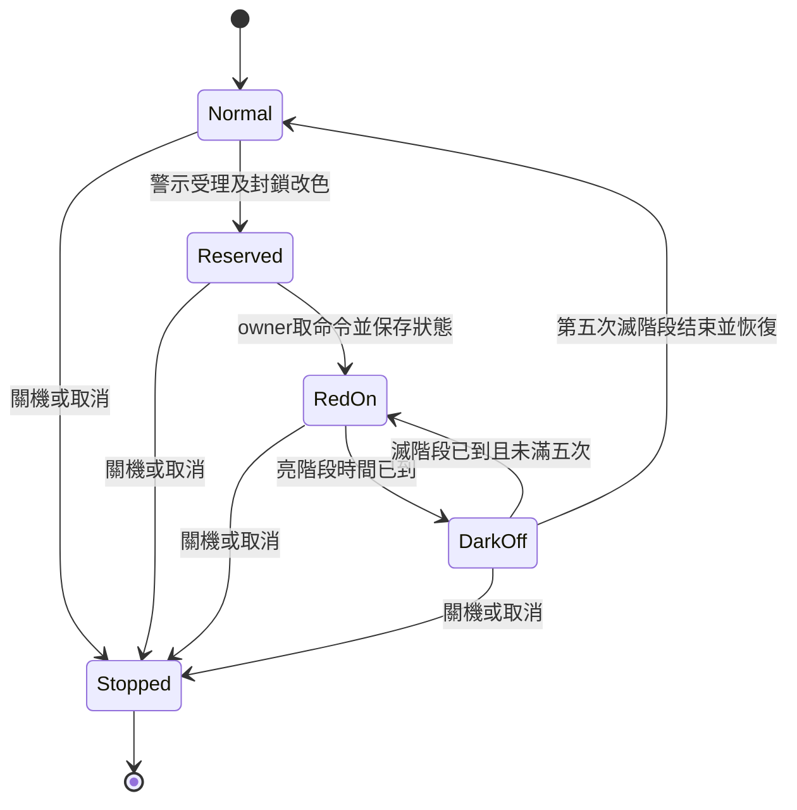

# 多個來源控制單一 LED：單一擁有者實驗講義

此版在 `refactor/led-single-owner` 分支實作，以重構前 `88ca2fb` 為可比較基線。主分支與 GitHub 已確認版本不因本實驗變更；目前只做桌面驗證，尚需 ESP32 實機確認。

## 1. 問題分成四層

| 層次 | 問題 | 本版解法 |
|---|---|---|
| 一致性 | 讀、計算、寫入交錯會否遺失更新？ | 正常色碼只由 owner 推進；同步階段沒有 await |
| 所有權 | 誰能操作 GPIO？ | 初始化安全熄燈後，只有 LedService.run 的控制流程與 finally |
| 仲裁 | 多個要求要聽誰的？ | 一般命令 FIFO；警示立即預約、拒絕未執行及新改色；關機優先 |
| 效果執行 | 紅閃五次如何按時間推進？ | frame 狀態機，不阻塞其他 task |

critical section 描述一致性保障，單一 owner 是責任分配，仲裁政策回答誰先／拒絕誰；三者不是互相排斥的理論。將方法放在同一類別並不保證只由一個 task 執行。此版把硬體所有權集中在唯一 task，來源不計算或寫入色碼。

非同步 for + await 本身不阻塞整個事件迴圈，也可取消；選 frame 狀態機是為了把受理、仲裁、時間推進與狀態查詢放在一起，不是修正其「不能中斷」。本實驗不以解決先前尚待觀測的卡鈍為目的，也不宣稱已改善效能。

## 2. 要素與互動



核心三個來源是按鈕、Web、光照；原本 MQTT 改色分支也改為提交命令，避免留下第四個直接寫入入口。本次未改 MQTT callback 接線，也未進行 broker 端到端測試，不能因适配分支存在而宣稱 MQTT 指令已實機驗證。

### 對照實作檔案

| 檔案／函式 | 工作 |
|---|---|
| main.main | 建立 LedService、create_task(run)，注入 Web 並傳給生產者 |
| tasks.button1_task | 讀按鈕、去彈跳、提交 cycle，消耗被拒絕的按下至放開 |
| tasks.light_sensor_task | 50 ms 取樣，管理 armed 與1000／1100遲滯，提交警示 |
| services.led_service.LedService.submit | 同步檢查命令、忙碌、停止、容量，建立 receipt，不碰GPIO |
| LedService.run / _step / _apply | 唯一 owner，每輪最多4筆命令，推進效果並渲染 |
| hardware.led.RgbLed.write | 色碼位元轉三個GPIO，只在輸出改變時寫入 |
| web_server.api_led_toggle | 受理後回202，不等待整段效果或假稱已執行 |
| web_server.api_led_command_result | 依ID查目前命令結果 |

生產者可以讀 busy 或唯讀 snapshot 以提示使用者，但不能讀改寫 desired color。同步 submit 會管理 queue、receipt 與預約旗標，這是受理控制面的操作；GPIO、正常狀態與效果執行仍只由 owner 更新。所有呼叫前提為同一個 uasyncio 事件迴圈，不可從 IRQ／執行緒直接操作這個清單佇列。

## 3. 命令種類與仲裁表

| 命令 | 參數 | 語義 |
|---|---|---|
| cycle | source=button1/web | 相對變更，不冪等；兩次必須推進兩色，不能合併 |
| set_color | value=0～7、source=mqtt | 絕對設定；目前也以FIFO處理，不另合併 |
| low_light_alert | source=light | 有時長警示；次數／亮滅時間從config取得 |

| 目前狀態／情況 | 新要求 | 結果 |
|---|---|---|
| 正常、有容量 | cycle或set_color | accepted，FIFO等owner執行 |
| 正常、普通佇列滿 | 改色 | rejected / queue_full；不靜默丟失 |
| 正常、有未執行改色 | 光照警示 | 預約警示，舊改色receipt改為rejected / alert_started，清除舊佇列 |
| 警示已受理或執行中 | 改色或警示 | rejected / busy，不排隊、不改正常狀態 |
| 已停止 | 任意命令 | rejected / stopped |
| 任意狀態 | request_stop | 停止受理，拒絕待處理，owner清理熄燈 |

警示優先於尚未執行的一般命令，不能撤銷先前已執行的改色。這是一條明确政策，不是通用數字優先權框架。只預約一個警示，所以普通佇列滿也能受理警示，先拒絕普通待處理，沒有額外成長的警示佇列。

## 4. 受理到完成：不能把202當成功執行



receipt 為字典：id、kind、source、status、reason。id在此次RAM服務內遞增，重啟重置；POST立即回的字典是副本，不會自動變成完成結果。owner更新內部receipt，客戶端再查詢。網頁最多輪詢15次、每次等待50 ms，逾時顯示尚未取得結果，不稱執行失敗；斷線亦顯示結果未知。

| HTTP／狀態 | 意義 |
|---|---|
| POST 202 accepted | 已受理，尚未執行；可能後續因警示被拒絕 |
| POST 409 rejected/busy | 警示期間立即拒絕 |
| POST 429 rejected/queue_full | 佇列已滿，來源可明確提示 |
| POST 503 | 服務未建立或停止 |
| 結果 accepted / executing | 等候或執行中 |
| 結果 executed | 軟體輸出已完成，不保證硬體實際亮燈 |
| 結果 rejected / failed / cancelled | 分別為政策拒絕、執行錯誤、停止中止 |
| 查詢404 | 最近16筆紀錄之外或未知ID，不代表從未執行 |

快取與佇列都有界，不寫Flash、不提供完整歷史。反覆拒絕的請求也可能把旧結果移出最近16筆；正在執行的命令仍保有內部receipt，但查詢可能已過期。這是小型教學系統的記憶體取捨，需長期歷史應另設儲存。

## 5. 警示競爭時機與狀態機



reserved在submit受理警示時就設true，沒有await，所以owner尚未取得排程也已拒絕新改色。只靠owner執行時才設busy會留下這個競爭窗口。警示开始會清除仍未執行的普通命令，且receipt留下拒絕原因，不會警示後補執行。



效果儲存phase_on、completed、started、count、on_ms、off_ms、saved、receipt。正常色碼／亮滅不被紅亮與全滅改寫，結束才恢復保存值。相對時間以time.ticks_ms/ticks_diff計算，支援tick回繞；不是從uasyncio匯入ticks_ms，也不直接減計數器。

owner每20 ms讓出排程；每輪最多4筆命令，避免一直drain而餓死效果。每輪最多推進一個亮滅階段，發生延遲時延長該階段，不快速補跳多個階段造成肉眼看不到五次。設定300 ms不代表硬體精準時間，仍受整個迴圈其他工作影響。

停止由request_stop在控制面設定停止、拒絕待處理；owner在下一次排程進入finally、標記未完成效果cancelled、寫0並發出stopped Event。main等待stopped後再結束喇叭清理。GPIO寫入錯誤會標failed並讓owner退出；若硬體連熄燈都失敗，軟體不能保證安全輸出。

## 6. 重新允許觸發：仍須先回到1100

> **警示完成不等於armed=true。警示結束後先取樣到ADC ≥ 1100，再降至ADC < 1000，才再次受理警示。**

armed仍在光照生產者內管理，50 ms取樣；警示busy期間不rearm。500→1050→500不重播；500→1100→999才重播。開機已暗仍觸發一次。兩個閾值形成遲滯，沒有新增冷卻時間或連續三次確認，避免暗中改變已確認功能。

## 7. 與上一版比較：是否更容易理解？

| 面向 | 重構前 | 此分支 |
|---|---|---|
| 操作來源 | 呼叫具有忙碌檢查的RgbLed方法 | 只提交cycle／警示／set_color |
| 硬體層 | 包含正常狀態、token、快照、關機與GPIO | 只把索引轉為GPIO，重複輸出不寫 |
| 效果 | tasks警示協程＋token控制 | owner狀態機＋reserved受理旗標 |
| Web回應 | 同步改色後回200 | 回202，依ID取得實際結果 |
| 拒絕政策 | 分散在控制器與各入口 | submit／owner集中，來源處理receipt |
| 額外複雜度 | 少量狀態，適合效果單純 | 佇列容量、結果保存、frame推進、HTTP查詢 |

可讀性初步評估：來源與硬體層更簡單，責任較集中；整體程式不一定更短，尤其加入受理結果與查詢是新增複雜度。先讀submit→_apply→_step→run較容易理解；狀態機對初學者需要講解時間與階段。需實際教學及實機使用後再決定是否保留此架構，不能僅依測試宣稱更穩定。

不採用普通await Lock，因警示期间需拒絕而非等待；不接受背景改色，因完成後要恢復原狀；不加入通用優先權／搶占框架，因目前規則只有警示與關機。Event本版只用於owner停止通知，owner不靠busy Event搶GPIO，也沒有多writer token交接。

## 8. 部署與驗收

上傳main.py、tasks.py、web_server.py、index.html、hardware/led.py，以及新增services目錄（__init__.py、led_service.py）。保留已正常的hardware/button.py、sensors.py、PIR／RFID模組與私人config.py；LIGHT_ALERT_*使用現有值，這次不用新增配置。重啟ESP32載入HTML快取，確認序列埠印出LED Owner啟動。

有意的差異：安全初始化先熄燈，白色7由owner在系統初始化完成後首次渲染，所以WiFi／NTP／MQTT初始化等待期間不再顯示白色。效果約20 ms frame延遲；Web既有URL維持，但成功受理從200改202。這些不是硬體故障。

驗收項目：

1. 正常時實體／Web各按一次，色碼前進兩次，循環0～7。
2. 暗觸發完整五次，原色或原先0熄滅恢復；期間按鈕不插入，按住直到結束不补執行。
3. 已受理但尚未執行的改色遇到警示，網頁顯示拒絕而不是執行成功。
4. 持續暗不重播，回亮到1100再暗才重播；閾值附近波動與警示期間亮暗切換不排隊。
5. 刷RFID、PIR音樂、Web刷新正常；中斷後熄燈；重啟結果紀錄與ID重置。

桌面20個Python測試通過，涵蓋命令FIFO、兩次cycle不合併、警示預約競爭、清除待執行改色、五次輸出／恢復、時間回繞、延遲不跳階段、有界記錄／佇列、取消／關機、GPIO失敗、Web202／409／結果查詢與既有PIR／RFID回歸。另以固定隨機種子進行1000輪混合命令、再200輪收尾，確認記憶體上限與效果結束；並驗證main任務錯誤後等待owner熄燈。網頁JavaScript模擬測試通過受理／執行／後續拒絕與原功能。非ESP32實機、broker、真實瀏覽器布局或實機壓力驗證。

此講義四張圖已用Mermaid11.13.0實際解析通過；未做Typora／VS Code視覺布局驗證，解析不等於所有編輯器的視覺布局一致。

## 9. 比較與回復

```powershell
git diff main...refactor/led-single-owner -- hardware/led.py tasks.py services/led_service.py
git switch main
```

main保存實驗前程式與講義補充，本分支尚未推送。回復時必須將main版本的hardware/led.py與main/tasks/web_server/index一起部署，不能混用兩版介面；額外services檔案可保留但舊main不會匯入。私人config.py未改，保留WiFi及已確認的警示參數。
