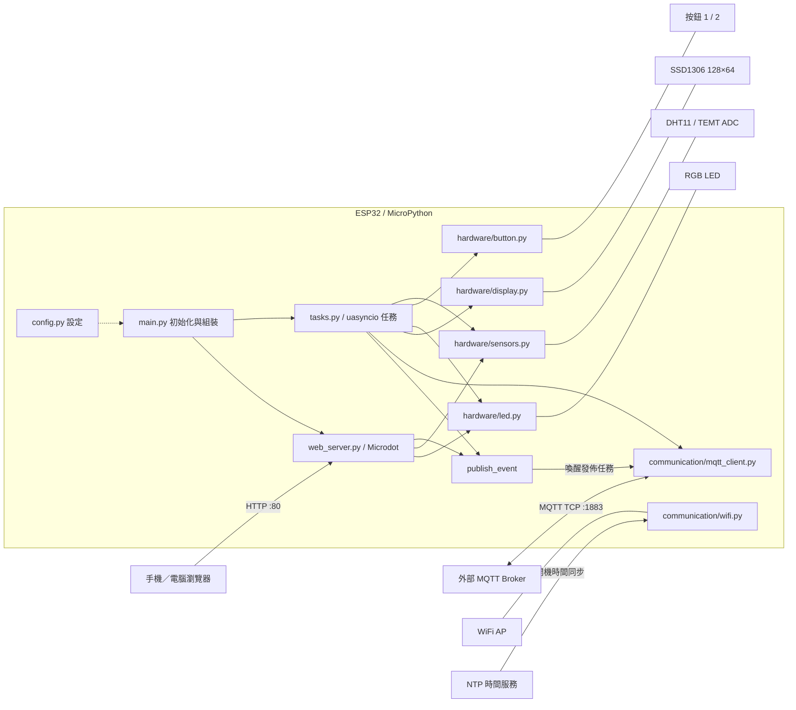

# IoT 教學專案系統架構

> 2026-10-05 修正更新：`LIGHT_AUTO_CONTROL_ENABLED` 預設為 False，光感持續讀取但不覆寫手動顏色；`RgbLed.off()` 現在只熄滅輸出並保留色碼，以 `is_on` 表示輸出開關狀態。下文關於光感覆寫與熄燈清除色碼的描述是修正前的分析。開機初始化仍先顯示白色 7，因此第一次按按鈕會切換到黑色 0，之後循環 1～7→0。

本文件依據目前目錄中的程式碼整理（2026-10-04）。範圍為靜態程式分析；未連接 ESP32 實機，未驗證網路連線、接線與韌體相容性。程式註解與實作不同時，以實作為準。

## 1. 系統定位

這是一套 ESP32 系列裝置上的 MicroPython 多感測器教學系統，使用 `uasyncio` 協同執行感測、控制、顯示與網路任務。確切開發板型號未在專案中指定，必須確認其支援目前的 GPIO 編號。

核心功能：

- DHT11 量測溫度與濕度。
- TEMT 光感測器透過 ADC 讀取亮度，控制 RGB LED。
- 兩個實體按鈕分別切換 LED 顏色、觸發 MQTT 發佈。
- SSD1306 OLED 顯示日期、星期、時間與溫濕度。
- 裝置上的 Microdot HTTP 伺服器提供儀表板與 REST API。
- MQTT 連接外部 Broker，發佈溫濕度；遠端 LED 指令已有任務設計，但目前回呼未接通。

目前沒有資料庫、歷史資料儲存、獨立雲端應用伺服器、帳號系統或 OTA 更新流程。感測狀態主要保存在裝置記憶體。

## 2. 整體架構圖



MQTT 入站控制在本圖只表示通訊連線；目前不能據此認定遠端 LED 控制已正常運作，詳見第 10 節。

## 3. 分層與模組責任

| 層級 | 檔案 | 責任與介面 |
|---|---|---|
| 組裝／生命週期 | `main.py` | 建立硬體與 MQTT 物件、連網校時、注入 Web 相依物件、啟動九個任務、異常清理 |
| 組態 | `config.py` | GPIO、輪詢頻率、光照門檻、WiFi profiles、MQTT topics、裝置名稱與色碼 |
| 應用協調 | `tasks.py` | 按鈕處理、週期量測、自動照明、OLED 更新、事件發佈與 MQTT 訂閱 |
| HTTP 介面 | `web_server.py` | Microdot 路由、HTML 載入、感測資料查詢、LED 控制與發佈事件 |
| 使用者介面 | `index.html` | 原生 HTML/CSS/JavaScript 儀表板，以 `fetch` 呼叫 REST API |
| 網路基礎 | `communication/wifi.py` | 包裝已知 WiFi 連線、NTP 校時及時間字串取得 |
| MQTT 基礎 | `communication/mqtt_client.py` | `MqttManager` 包裝 `mqtt_as.MQTTClient`，管理連線、發佈、訂閱與回呼 |
| 硬體抽象 | `hardware/button.py` | 上拉輸入、低電位按下、非同步去彈跳與等待按下／釋放 |
| 硬體抽象 | `hardware/led.py` | 三 GPIO 的 3-bit 色碼、開關與循環換色 |
| 硬體抽象 | `hardware/sensors.py` | DHT11 量測與快取、ADC 量測與快取 |
| 硬體抽象 | `hardware/display.py` | I2C／SSD1306 初始化、兩行文字、可選中文點陣字型 |
| 支援函式庫 | `lib/`、`lib/lib/` | 網路與時間工具、MQTT、OLED、字型及未整合的周邊驅動 |

`main.py` 將同一批物件交給任務，並指定給 `web_server.py` 的模組全域變數，因此 Web、按鈕與週期任務共用硬體狀態。這是一個單一事件迴圈中的協同多工系統，不是多執行緒或多程序架構。

## 4. 目錄結構與函式庫角色

```text
專案根目錄/
├── main.py
├── config.py
├── tasks.py
├── web_server.py
├── index.html
├── communication/
│   ├── wifi.py
│   └── mqtt_client.py
├── hardware/
│   ├── button.py
│   ├── led.py
│   ├── sensors.py
│   └── display.py
└── lib/
    ├── boot.py
    ├── ns_tools.py
    ├── aiot_tools.py
    ├── ESPWebServer.py
    ├── mfrc522.py
    ├── mfrc522_async.py
    ├── mfrc522_async_sync.py
    ├── sounds.py
    ├── queue_ns_async.py
    └── lib/
        ├── mqtt_as.py
        ├── mqtt_async.py
        ├── ssd1306.py
        ├── bitmap_font_tool.py
        ├── async_queue.py
        ├── fonts/fusion_bdf.12
        └── ssd1306-0.1.0.dist-info/
```

實際主流程使用 `mqtt_as`，不是 `mqtt_async`；Web 使用 Microdot，不是 `ESPWebServer.py`。RFID 驅動、音效與 queue 函式庫未由目前主流程整合。`aiot_tools.py` 中的 LLM、新聞、音效等工具也不能視為本系統已啟用的功能；這裡只使用其時間工具作為備援。

## 5. 硬體與組態

| 元件 | GPIO／介面 | 實際用途 |
|---|---|---|
| RGB LED | R=37、G=35、B=33 | GPIO 輸出，1 代表該色通道開啟 |
| 按鈕 1 | 17 | `Pin.IN`、`PULL_UP`；按下循環換色 |
| 按鈕 2 | 21 | 同上；按下設定 MQTT 發佈事件 |
| DHT11 | 18 | 數位溫濕度感測 |
| TEMT 光感測器 | ADC GPIO 8 | `ADC.ATTN_11DB`，程式以 0～4095 解讀原始值 |
| OLED | I2C 0；SCL=7、SDA=5 | SSD1306，128×64 |
| RFID（預留） | SCK=12、MOSI=11、MISO=10、RST=9、CS=13 | 僅有設定及驅動，無啟動任務 |

LED 索引依序為：0 黑（全滅）、1 藍、2 綠、3 青、4 紅、5 紫、6 黃、7 白。`set_color_by_index()` 使用 `% 8` 正規化索引。

光感控制採雙門檻：ADC <1000 時呼叫 `on(current_color_index)`，>1100 時呼叫 `off()`，介於兩者之間不改變狀態。這是遲滯控制設計，但目前 `off()` 也會把色碼改成 0，導致暗時可能仍使用 0 而無法恢復亮燈。

OLED 的腳位、尺寸、字型路徑目前直接寫在 `hardware/display.py`；雖然 `config.py` 有相對應設定，顯示模組並未使用它們。

## 6. 開機與執行生命週期

1. `main.py` 匯入組態、硬體、MQTT、任務與 Web 模組；缺少必要函式庫時可能在初始化前就失敗。
2. `uasyncio.run(main())` 建立主事件迴圈。
3. `initialize_system()` 建立 RGB LED 並顯示白色，建立兩個按鈕、DHT11 及 ADC，先量測一次 DHT11。
4. WiFi 工具掃描已知 AP，選擇訊號最強者，最多輪詢約 10 秒確認連線。失敗時包裝層回傳第一組設定，這不等於已連線。
5. 校時優先呼叫 `ns_tools.mySetTime()`，失敗再試 `aiot_tools.set_time()`；實際傳入時區 8。校時只在初始化階段執行。
6. 建立 `MqttManager`，初始 MQTT 連線最多嘗試三次，重試間隔 2 秒；失敗後仍繼續主流程。
7. 建立共用 `publish_event`，將 MQTT、事件及硬體物件注入 Web 模組。
8. `uasyncio.gather()` 執行九個應用任務；OLED 在其顯示任務中才初始化，HTML 在 Web 任務中載入。
9. 一般異常路徑嘗試關閉 LED 與斷開 MQTT；`KeyboardInterrupt` 路徑只關閉 LED，未提供完整一致的所有服務關閉流程。

WiFi 與 NTP 包裝函式雖然宣告為 `async`，內部工具仍使用同步網路呼叫及 `time.sleep()`；這些不是完全非阻塞的操作。DHT11 的同步量測也會暫時占用事件迴圈。

## 7. 九個非同步任務

| 任務 | 觸發／頻率 | 讀取 | 輸出／副作用 |
|---|---|---|---|
| `button1_task` | 按下；輪詢 30ms、去彈跳約 20ms | 按鈕 1 | `rgb_led.next_color()`；釋放後休息 100ms |
| `button2_task` | 按下；同上 | 按鈕 2 | `publish_event.set()`；不直接量測或發佈 |
| `dht11_read_task` | 每 2 秒 | DHT11 | 更新溫濕度快取 |
| `light_sensor_task` | 每 50ms | ADC | 雙門檻自動控制 LED |
| `oled_display_task` | 每 1 秒 | 時間、DHT 快取 | OLED 日期／時間與溫濕度 |
| `mqtt_publish_task` | 等待發佈事件 | DHT 快取 | 發佈文字訊息，之後清除事件 |
| `mqtt_subscribe_task` | 啟動時訂閱；之後每 10 秒休眠 | 預期接收 LED 命令 | 建立命令解析函式，但回呼未接通 |
| `web_server_task` | HTTP 請求 | HTML、共用物件 | 監聽 `0.0.0.0:80` |
| `sensor_monitor_task` | 每 10 秒 | 無實際檢查 | 目前只有休眠，為擴充占位 |

MQTT 函式庫另有其內部背景任務管理收訊、連線維持與重連，不包含在以上九個應用任務中。

## 8. 資料流與控制流

### 感測與顯示

`DHT11 → measure() → temperature/humidity 快取 → OLED、HTTP API、MQTT 發佈任務`。

`TEMT → ADC.read() → light_sensor_task → RGB LED`；HTTP `/api/data` 也會直接再次讀取 ADC，而非只讀快取。亮度數值是原始 ADC，不是校正後的 lux。

### 本地／網頁控制

`按鈕 1 或 POST /api/led/toggle → next_color() → GPIO`。

`按鈕 2 或 POST /api/publish → publish_event.set() → mqtt_publish_task → DHT 快取 → Broker`。

發佈使用最近一次快取，不會因按鈕按下立即重新量測；也沒有定時 MQTT 上報。`Event` 只有設定／清除狀態，不會記錄觸發次數，多次觸發可能合併，且發佈期間的新觸發可能被後續 `clear()` 消除。

### 遠端 MQTT 控制（設計路徑）

`外部 MQTT 用戶端 → cmd01 topic → handle_cmd() → set_color_by_index()`。

解析器接受包含 `led` 的字串，從最後的 `:` 或 `=` 後取整數，例如 `led:4`、`led=4`。目前此處為未完成的路徑，不能當作已可使用的操作方式。

## 9. HTTP 與 MQTT 介面

### HTTP API

| 方法 | 路徑 | 回傳／行為 |
|---|---|---|
| GET | `/` | `index.html`，`text/html; charset=utf-8` |
| GET | `/index.html` | 同主頁 |
| GET | `/api/data` | `temp`、`humidity`、`light`、`status` |
| POST | `/api/led/toggle` | 循環切換 LED 顏色；一般回傳 `status: ok` |
| POST | `/api/publish` | 設定發佈事件；立即回傳，不等待 MQTT 完成 |
| GET | `/api/status` | 固定回傳 `status: ok`、`message: System running` |

資料範例：`{"temp": 26.0, "humidity": 60.0, "light": 1250, "status": "ok"}`。目前沒有認證、HTTPS、WebSocket 或 SSE。前端每秒輪詢 `/api/data`，沒有呼叫 `/api/status`；頁面上的正常狀態不能代表 MQTT 或感測器健康。

### MQTT

| 項目 | 目前實作 |
|---|---|
| Broker | `broker.emqx.io`，由 `main.py` 建構時直接指定 |
| 傳輸 | 函式庫預設 TCP 1883、TLS 關閉 |
| 發佈主題 | `nuu/csie/iot1133/TempHumi` |
| 訂閱主題 | `nuu/csie/iot1133/cmd01` |
| QoS | 應用呼叫均為 0 |
| Payload | 裝置名稱加溫濕度的 UTF-8 人類可讀文字，非結構化 JSON |
| 發佈觸發 | 實體按鈕 2／Web 發佈按鈕 |

`config.py` 的萬用訂閱 `nuu/csie/iot1133/#` 沒有被使用；`DEVICE_ID` 沒有傳給 MQTT client 作為 client ID。`MQTT_PORT` 與重連退避設定也未由管理器套用，實際重連由 `mqtt_as` 內部實作處理。

## 10. 現況限制與待完善項目

| 項目 | 程式證據與影響 |
|---|---|
| MQTT 回呼介面不匹配 | `mqtt_as.py` 用同步方式 `self._cb(topic, msg, retained)` 呼叫回呼，但 `MqttManager.on_message` 是 `async def`，沒有被排程或 await；其函式內容不會正常執行 |
| 指令分派缺失 | `MqttManager.subscribe(..., callback=handle_cmd)` 沒有儲存／呼叫 callback；因此即使修正上述 async 問題，LED 解析器仍不會被呼叫 |
| 重連後未重新訂閱 | 函式庫預設 clean session，`on_connected()` 只設定連線旗標；沒有重訂閱命令主題的應用邏輯 |
| 連線狀態可能過期 | `_connected` 與事件未隨非預期斷線清除；任務亦未檢查 `wait_connected()` 超時回傳值 |
| LED 多方寫入 | 按鈕、Web、光感任務直接改同一 LED，沒有自動／手動模式或優先權；50ms 光感控制會覆寫手動操作 |
| 熄燈後失去原色 | `off()` 把 `current_color_index` 改成 0；暗時 `on(0)` 仍為全滅 |
| DHT 失敗值與註解不同 | `measure()` 失敗時回傳 `(-1,-1)` 並覆寫快取，沒有保留最後成功資料；任務中「失敗使用上次資料」分支不會因此被執行 |
| HTTP 成功語意過度 | `/api/publish` 只設定事件便宣稱 published；物件缺失仍可能回成功。LED API 同樣可能未執行動作便回成功 |
| 健康檢查為占位 | `/api/status` 不回 uptime 或真實健康狀態；`sensor_monitor_task` 沒有實際監控 |
| JSON 手動串接 | 值為 `None` 時可能產生非合法 JSON；錯誤訊息中的引號／換行也未跳脫。正常 DHT 物件預設為數值，但異常情況仍需處理 |
| 前端顯示缺陷 | `data.value || '--'` 將有效 0 顯示成缺值；連線恢復後沒有把失敗狀態改回正常 |
| 設定未完全集中 | OLED 參數、時區、Broker、部分更新頻率仍直接寫在實作內 |
| 部署相依缺失 | 此目錄沒有 Microdot 程式、套件鎖定、部署脚本或根目錄 `boot.py`；函式庫路徑需重新整理 |
| 機密與存取控制 | WiFi profiles 與工具庫使用原始碼設定憑證，文件不列出其值；HTTP 無驗證，MQTT 使用共用 topic、未設定帳密與 TLS |

以上是依程式碼確認的限制，尚未在實機重現。建議優先完成部署相依與 MQTT 回呼，再修正 LED 狀態／控制模式、感測失敗處理及 API 成功語意。

## 11. 部署架構與檢核

目前原始目錄與 import 路徑不完全一致：`ns_tools` 在 `lib/`，`mqtt_as`、`ssd1306`、`bitmap_font_tool` 在 `lib/lib/`；程式要求字型位於 `./lib/fonts/fusion_bdf.12`，但原始檔在 `lib/lib/fonts/`。僅把整個原始目錄原樣上傳，不能保證依賴可被找到。

建議在裝置上整理為下列部署結構（這是部署建議，尚未替目前專案搬移檔案）：

```text
裝置檔案系統 /
├── main.py / config.py / tasks.py / web_server.py / index.html
├── hardware/       # 保留目前硬體模組
├── communication/  # 保留目前通訊模組
└── lib/
    ├── ns_tools.py / aiot_tools.py
    ├── mqtt_as.py / ssd1306.py / bitmap_font_tool.py
    ├── microdot.py 或 microdot/  # 依所選相容版本
    └── fonts/fusion_bdf.12
```

需確認 MicroPython 韌體提供 `machine`、`network`、`dht`、`uasyncio`、`ntptime` 及函式庫引用的其他內建模組；所選 Microdot 必須支援目前的 `Microdot`、`Response` 與 `start_server()` 介面。備援 `aiot_tools` 匯入時也需要 `urequests` 等依賴。

`lib/boot.py` 只有 `sys.path.reverse()` 等內容；其目前位置不能視為裝置根目錄的開機腳本，而且反轉路徑不會加入缺少的 `lib/lib` 路徑。

實機檢核順序：

1. 確認開發板 GPIO、電源、共地與周邊接線。
2. 確認必要模組可 import，字型和 HTML 可讀取。
3. 分別確認 LED、按鈕、DHT11、ADC、OLED。
4. 確認 WiFi IP、校時與同網段瀏覽器可連上 HTTP 80。
5. 確認三個感測欄位、換色與發佈事件。
6. 用外部 MQTT 用戶端驗證溫濕度 payload；指令功能須先修正回呼再驗證。
7. 驗證斷網／重連、感測失敗、按鈕連按及手動／自動 LED 控制的互動。

## 12. 教學主題對應

| 教學主題 | 對應程式與可討論重點 |
|---|---|
| 模組化與責任分離 | `main` 組裝、`hardware` 封裝、`communication` 通訊、`tasks` 協調 |
| GPIO 與位元運算 | RGB 3-bit 色碼、上拉輸入與低電位按鈕 |
| 感測與控制 | DHT 快取、ADC 原始值、雙門檻遲滯、錯誤資料品質 |
| 非同步與事件 | `gather`、`sleep`、`Event`、協同多工與同步阻塞操作 |
| 顯示與字型 | I2C、SSD1306、點陣中文字型與降級顯示 |
| 網路與時間 | AP 掃描、RSSI 選擇、NTP、UTC+8 |
| MQTT 發佈訂閱 | topic、QoS、callback 契約、重連與重新訂閱 |
| Web 與 REST | HTTP method、JSON、前端輪詢、非同步工作完成語意 |
| 系統整合 | 共用狀態、控制優先權、配置集中、部署與可觀測性 |

這份專案的架構主軸是「裝置端分層模組 + 單一非同步事件迴圈 + 共用感測狀態 + 事件驅動發佈 + HTTP／MQTT 雙通訊介面」。未整合的 RFID、音效、LLM 與替代伺服器／MQTT 函式庫，可作為後續課程延伸素材。
