# 物聯網軟體架構講義：Web 畫面、按鈕與資料生命週期

**適用案例：**本專案目前的 ESP32／MicroPython、Microdot、原生 HTML／JavaScript 與 MQTT 實作。**整理日期：**2026-10-05。這是獨立講義，不是變更紀錄；不修改應用程式或 ChangeLog。

本講義依目前程式逐步追蹤。圖中成功情境不代表已做實機驗證；現有缺陷另列在各節，避免把預期設計當成已實現功能。行號以整理當時為準，之後可依函式名稱查詢。

## 1. 學習目標與畫面對照

閱讀每條流程時，回答六個問題：誰發起？誰接收？呼叫哪個函式？參數從何處來？結果存在哪裡？何時更新或失去？

| 畫面元件 | HTML 位置／ID | 發起方式 | 實際來源或作用 |
|---|---|---|---|
| 標題、說明、單位、頁尾 | `index.html` 固定文字 | 載入 HTML | 靜態字串，沒有專屬 API |
| 狀態區的溫度 | `temp`，第 195 行 | `updateData()` | `data.temp` |
| 溫度卡片 | `tempCard`，第 210 行 | 同上 | 同一個 `data.temp`，不是第二次量測 |
| 狀態區的濕度 | `humidity`，第 199 行 | 同上 | `data.humidity` |
| 濕度卡片 | `humidityCard`，第 215 行 | 同上 | 同一個 `data.humidity` |
| 光照卡片 | `lightCard`，第 220 行 | 同上 | `data.light`，原始 ADC 值 |
| 狀態文字 | `status`，第 203 行 | 初始 HTML／資料更新例外 | 初始為正常；catch 時改為連接失敗 |
| 按鈕 1：切換 LED | 第 226 行，`onclick="toggleLED()"` | 使用者 click | `POST /api/led/toggle`，循環下一個色碼 |
| 按鈕 2：發布資料 | 第 227 行，`onclick="publishData()"` | 使用者 click | `POST /api/publish`，設定發佈事件 |
| 發佈成功／失敗視窗 | JavaScript `alert()` | 發佈按鈕處理 | 依 HTTP 結果或 fetch 例外，沒有追蹤 MQTT 最終結果 |

畫面沒有 LED 色碼欄位、裝置時間欄位或歷史圖。OLED 顯示時間，但它不參與 Web DOM 更新。頁尾「每 1 秒」是固定文字，真正的計時來自 JavaScript 的 `setInterval()`。

## 2. 先分清楚兩個執行世界

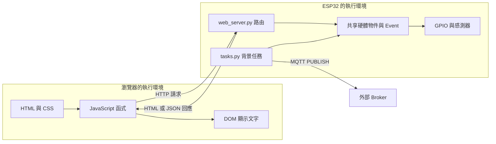

瀏覽器不能直接呼叫 ESP32 的 Python 函式。`fetch('/api/data')` 送出 HTTP 訊息，Microdot 收到後才呼叫 `api_data(request)`；回程也必須先把 Python 資料轉成 JSON 文字，瀏覽器再解析成自己的 JavaScript 物件。

**三種「物件」要分開：**ESP32 的 `dht_sensor` 是 Python 物件；HTTP JSON 是序列化字元／位元組；瀏覽器的 `data` 是解析後的新 JavaScript 物件。它們不是跨電腦共享的同一份記憶體。

## 3. 開機準備：後面的呼叫為何找得到硬體？

### 3.1 初始化與啟動順序

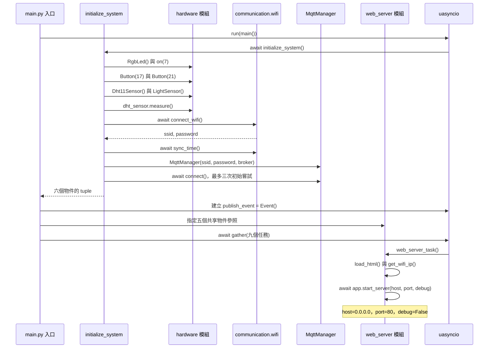

圖中 `Entry` 代表 `main.py` 內的主流程。具體呼叫與參數如下。

| 呼叫位置 | 被呼叫的程式 | 實際參數／來源 | 產生的狀態 |
|---|---|---|---|
| `main.py:157` | `uasyncio.run(main())` | `main()` 產生的 coroutine | 主事件迴圈執行主協程 |
| `main.py:29` 初始化 | `RgbLed()` | 呼叫者不傳參數；類別讀 `config` 的 GPIO 37／35／33 | 三個 Pin、索引 0、`is_on=False` |
| 初始化下一步 | `rgb_led.on(7)` | 常數 7，白色 | GPIO 三色開啟；索引變 7 |
| 初始化按鈕 | `Button(config.BUTTON1_PIN)` 等 | 17／21 來自設定 | 按鈕 Pin 輸入物件 |
| 初始化感測 | `Dht11Sensor()` | 內部讀 `config.DHT11_PIN=18` | DHT driver；溫濕度先設 0.0 |
| 初始化感測 | `LightSensor()` | 內部讀 `TEMT_ADC_PIN=8` | ADC、衰減設定；`current_value=0` |
| 初次量測 | `dht_sensor.measure()` | 無外加參數；使用 `self.sensor` | 快取第一次量測結果，失敗則 -1／-1 |
| 初始化網路 | `connect_wifi()` | 內部將 `WIFI_PROFILES`、`try_time=10` 傳給 `ns_tools.connect_to_known_wifi()` | WiFi 連線；回傳 SSID／密碼，不在講義揭露其值 |
| 初始化 MQTT | `MqttManager(ssid, password, broker='broker.emqx.io')` | SSID／密碼由前一步回傳，Broker 由 main 指定 | client、連線旗標與另一個連線 Event |
| `main.py:98` | `uasyncio.Event()` | 無參數 | `publish_event`，初始未設定 |
| `main.py:111` | `uasyncio.gather(...)` | 各任務 coroutine，內含同一批物件參照 | 背景量測、顯示、發佈及 Web 等任務交錯執行 |
| `web_server.py:227` | `web_server_task()` | 無參數；讀模組全域狀態 | 載入 HTML，啟動 HTTP 80 |

WiFi 失敗時包裝函式可能只回傳預設 profiles；拿到 SSID／密碼不保證已連網。MQTT 初始嘗試完成後才啟動 gather，因此 Web 啟動時間受初始化等待影響。NTP 校時供時間顯示，Web API 的三個感測數值沒有時間欄位。

### 3.2 相依物件如何傳給 Web 與任務

```python
# main.py:98～105，現行程式
publish_event = uasyncio.Event()
web_server.mqtt_manager = mqtt_manager
web_server.publish_event = publish_event
web_server.dht_sensor = dht_sensor
web_server.rgb_led = rgb_led
web_server.light_sensor = light_sensor
```

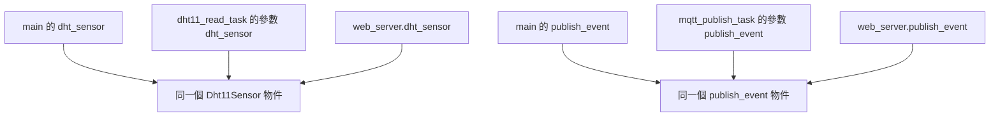

這些指定傳遞的是**物件參照**，沒有複製一份感測器。Web 讀到的屬性，就是背景量測任務更新的屬性。`self` 是 Python 呼叫物件方法時隱含傳入的接收者；例如 `rgb_led.next_color()` 沒有寫參數，但方法依然收到 `self=那個共享 LED 物件`。

`web_server` 匯入時五個參照先為 `None`，main 才完成指定。相依注入的作用，是讓服務在接到 HTTP 前取得必要物件；目前方式是模組全域變數，未採獨立容器或 service 類別。

## 4. 第一次開啟網頁：Flash 檔案如何變成畫面？

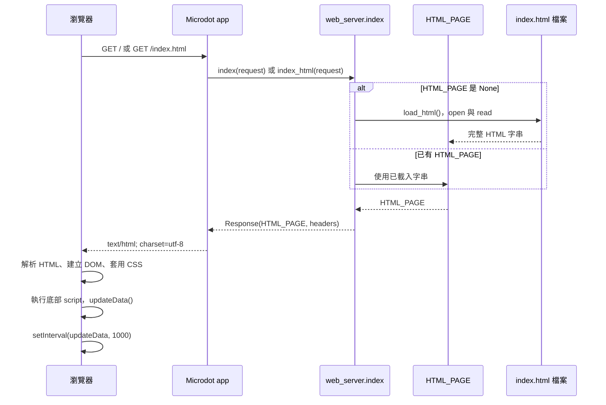

| 步驟 | 程式與參數 | 來源與存放 |
|---|---|---|
| 事先載入 | `web_server_task()` 先呼叫 `load_html()` | 通常在首次 HTTP 前已讀取檔案 |
| 讀檔 | `open('index.html', 'r', encoding='utf-8')` | 相對於裝置目前工作目錄，必須確保檔案可找到 |
| 儲存 | `HTML_PAGE = f.read()` | ESP32 RAM 的模組全域字串；with 結束關閉檔案，不清除字串 |
| 路由註冊 | `@app.route('/')`／`@app.route('/index.html')` | 匯入模組時將 URL 與 handler 登記於 app |
| 請求派發 | Microdot 呼叫 `index(request)` | `request` 由框架解析 HTTP 產生，不是 JavaScript 直接傳 Python 物件 |
| 回應建立 | `Response(HTML_PAGE, headers={...})` | 本文是已載入字串；header 指定 HTML／UTF-8 |
| 瀏覽器解析 | HTML→DOM，CSS→樣式 | 建立 Browser 記憶體中的元素及初始 `--`／正常文字 |
| 程式啟動 | `updateData(); setInterval(updateData, 1000);` | script 在 body 後端，前面的顯示節點已建立 |

`request` 在目前這些 handler 中沒有被讀取；URL 路由負責選函式。`0.0.0.0` 是伺服器綁定所有 IPv4 介面的地址，不是學生應在瀏覽器輸入的目的 IP；實際目的 IP 由 WiFi 取得並印在序列日誌。

**HTML 的生命週期：**Flash 原始檔不因請求結束而刪除。RAM 中 `HTML_PAGE` 保持存在直到重新指定或程式／裝置重啟。上傳新 HTML 並不保證既有 RAM 快取或已開啟頁面會自動更新；目前沒有重新載入 API，通常需要重啟裝置並重新載入頁面。

讀檔失敗會將錯誤提示 HTML 存入 `HTML_PAGE`，而非維持 `None` 讓每個請求重讀。此時瀏覽器可能只看到替代錯誤頁，沒有原儀表板的 JavaScript 與按鈕。

理論：路由是「方法／路徑→處理函式」的派發；HTTP Response 以 header 說明正文應如何解釋。Microdot 建構 request 和排程 handler 的框架內部細節依安裝版本而異，相關 API 見 [Microdot Core API](https://microdot.readthedocs.io/en/latest/api/microdot.html)。

## 5. 溫度／濕度：背景量測與網頁查詢是兩條流程

### 5.1 第一條：背景任務產生快取

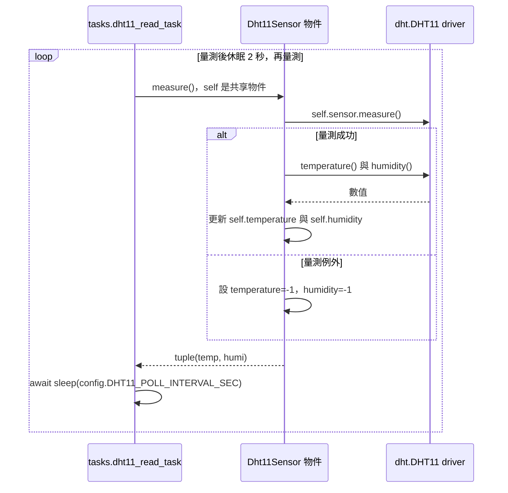

| 呼叫 | 參數怎麼拿到 | 回傳／寫入 |
|---|---|---|
| `tasks.dht11_read_task(dht_sensor)` | main 將初始化的 DHT 物件當參數 | 一直執行的協程 |
| `dht_sensor.measure()` | 無外加參數；從 self 找到 driver | tuple；更新兩個物件屬性 |
| driver `temperature()`／`humidity()` | 使用最近一次 driver 量測 | 溫度與相對濕度 |
| `sleep(config.DHT11_POLL_INTERVAL_SEC)` | 設定值 2 | 讓出執行權，等待下一輪 |

這裡是**最新值快取**，沒有保存歷史串列。新量測覆蓋舊屬性；舊數值若沒有其他參照就可被回收。注意現行程式失敗會寫 -1；雖然註解說「最後成功資料」，實作未保留 last-good，也沒有時間／品質標記。tuple `(-1,-1)` 仍是真值，所以任務的 `if result` 不會以此判定失敗。

### 5.2 第二條：瀏覽器取快取，更新兩組顯示

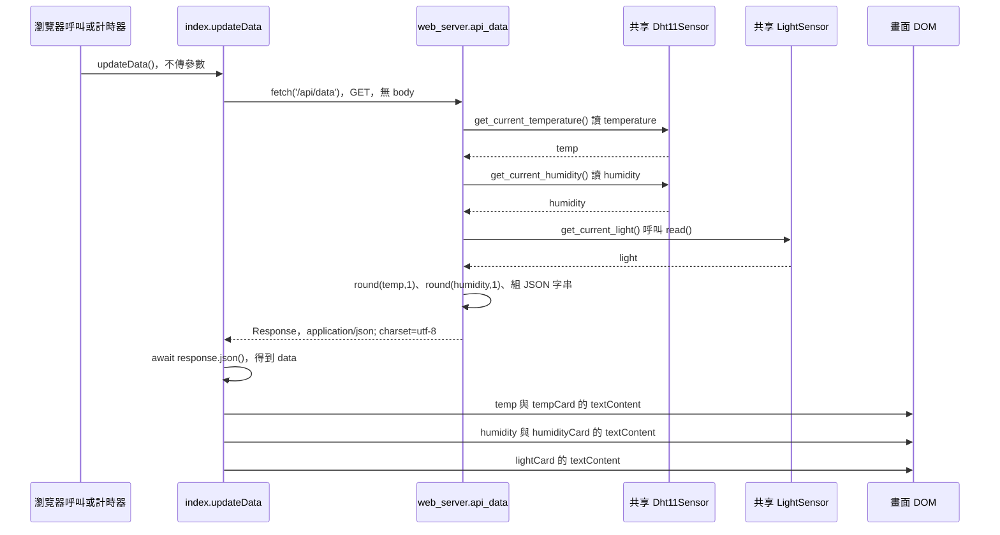

`get_current_temperature()` 和 `get_current_humidity()` 在 `web_server.py:61`／`:71`，它們不呼叫 `measure()` 或 `get_data()`，而是直接讀取同一 DHT 物件的屬性。HTTP 請求本身不重新量測 DHT。

成功回應範例（假設當次數值）：

```json
{"temp":26,"humidity":60,"light":950,"status":"ok"}
```

前端 `index.html:238` 的核心程式：

```javascript
const response = await fetch('/api/data');
const data = await response.json();
const temp = data.temp || '--';
document.getElementById('temp').textContent = temp;
document.getElementById('tempCard').textContent = temp;
```

| 參數／變數 | 來源 | 作用／保存範圍 |
|---|---|---|
| `'/api/data'` | JavaScript 固定路徑 | 依目前頁面 URL 的 origin 發出請求，沒有指定外部 Broker |
| Python `request` | Microdot | 代表這次 HTTP；handler 不使用其中參數 |
| `temp`／`humidity` | DHT 屬性 | API 的區域名稱，沒有反向修改感測屬性 |
| `1` | `round(value,1)` 的常數 | 四捨五入到一位小數，不代表提高感測精度 |
| `response_json` | Python 字串串接 | 這次回應正文 |
| JS `response` | fetch Promise 完成值 | 瀏覽器 Response，與 Python Response 是不同物件 |
| JS `data` | `response.json()` | JSON 解析產生的 JavaScript 物件 |
| `'temp'`／`'tempCard'` | HTML 中相對應的 ID | `getElementById()` 查找節點 |
| `textContent = temp` | 解析到的值／替代字串 | 修改節點文字，瀏覽器後續重繪 |

濕度重複同一模式，使用 `data.humidity` 與兩個濕度 ID。因此畫面上四個溫濕度數字，只需要一次 `/api/data` 回應，不是四次 HTTP 或四次量測。正文只有數值；°C／% 是 HTML 已有的固定單位。

**更新不等於清空：**一次 fetch 結束後，JS 區域物件在沒有其他參照時可被垃圾回收；DOM 中已寫入的文字仍保留，直到下一次更新或頁面被替換。ESP32 快取也不因查詢被清除。HTTP 請求結束後，框架不再需要的 request／response 可釋放，確切時點由版本及 GC 決定。

## 6. 光照：API 會額外進行一次 ADC 讀取

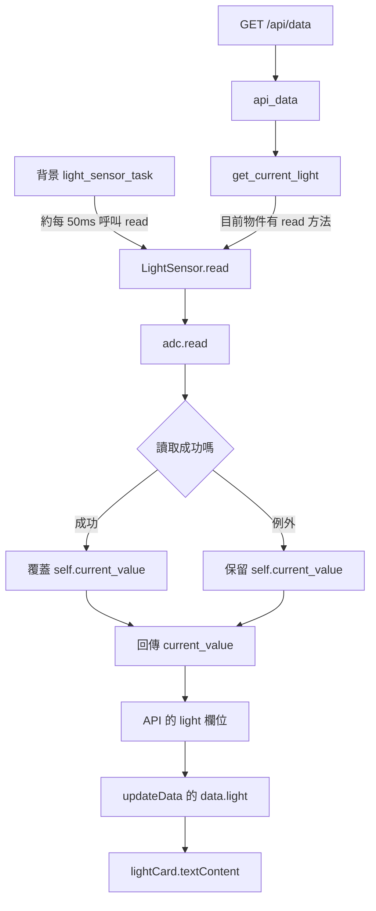

目前 `LightSensor` 有 `read()`，因此 `get_current_light()` 的其他分支不會走到。真實參數是初始化時的 `Pin(8)` 與 `ADC.ATTN_11DB`；每次 `read()` 不再傳 Pin，ADC 物件已保留初始化設定。

成功時 `self.current_value` 被新 ADC 整數取代；ADC 讀取失敗時 `LightSensor.read()` 捕捉例外並回傳先前值，沒有附帶「這次其實讀取失敗」的訊號。Web helper 若沒有可用感測物件或自身失敗，則可能回傳 0。

網頁顯示的是 raw ADC，不是 lux。此專案以 0～4095 解讀 ADC；實際量測範圍與校正須依板型／韌體確認。`get_brightness_percent()` 未被 Web 呼叫，沒有將資料轉成百分比。

`LIGHT_AUTO_CONTROL_ENABLED=False` 時，背景任務仍讀 ADC，只是不依亮度修改 LED。所以「停止自動照明」不會讓網頁光照欄位停止更新。

## 7. 一秒輪詢與「正常／連接失敗」如何運作

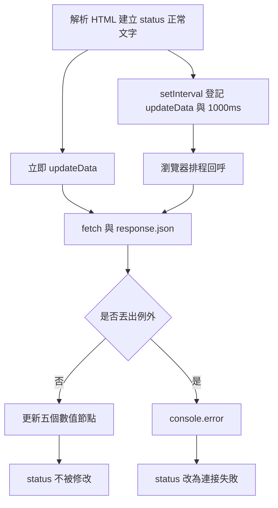

| 操作 | 實際參數 | 機制 |
|---|---|---|
| `updateData()` | 無參數 | 畫面載入後立即取資料 |
| `setInterval(updateData,1000)` | 函式參照與 1000 毫秒 | 登記未來回呼；不是此處直接執行函式 |
| `await fetch(...)` | URL | 該協程暫停等待網路，不阻止所有瀏覽器工作 |
| `await response.json()` | 無參數 | 讀取正文並解析 JSON；解析失敗也會進 catch |
| catch 修改 status | 固定 ID／固定失敗字串 | 只顯示「資料更新流程丟出例外」 |

現行程式有四個重要限制：

1. **「正常」是 HTML 初始值。**`data.status` 沒有被前端使用，也沒有查 `/api/status`。正常不證明 MQTT 在線或 DHT 健康。
2. **失敗後不會自動改回正常。**下次成功只更新數字，status 可能一直顯示失敗。
3. **`value || '--'` 將 0 視為缺值。**空值替代與合法零值被混淆；-1 則仍會顯示。若教學示範改善，可以討論 `??`，但目前程式未修改。
4. **`updateData()` 沒有檢查 `response.ok`。**fetch 收到 HTTP 404／500 通常仍回傳 Response；是否進 catch 還取決於網路與 JSON 解析，不能把 catch 等同 HTTP 失敗。[Fetch API 說明](https://developer.mozilla.org/en-US/docs/Web/API/Fetch_API/Using_Fetch)

`setInterval` 不等待先前那次 async `updateData()` 完成，慢網路可能有重疊請求，甚至較舊回應晚到而蓋掉新畫面。1000ms 是排程間隔，不是精確更新或完成保證；瀏覽器背景節流也會影響執行。[setInterval 機制](https://developer.mozilla.org/en-US/docs/Web/API/Window/setInterval)

瀏覽器回呼、Promise 與 ESP32 的 uasyncio 是**兩個獨立的排程系統**，以網路訊息溝通。持續的 coroutine 在 await 期間保留必要執行狀態，並非每次等待都從函式第一行重跑。

## 8. 按鈕 1：由 click 一路到三個 GPIO

### 8.1 呼叫時序

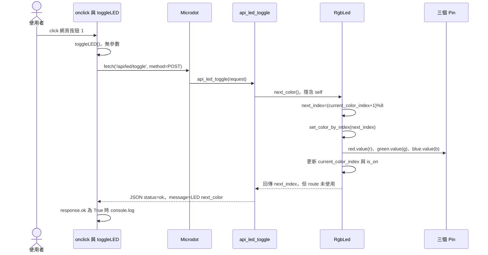

圖中為 LED 物件及方法存在且無例外的路徑。若不存在，現行 route 仍可能回 `status=ok`，實際並未操作。

### 8.2 逐層參數與資料

| 順序 | 程式位置／呼叫 | 代入的參數 | 參數來源／結果 |
|---|---|---|---|
| 1 | `index.html:226` 的 onclick | `toggleLED()` 不傳參數 | HTML 指定 callback；沒有讀輸入欄位 |
| 2 | `index.html:266` 的 fetch | 路徑、`{method:'POST'}` | 固定字串／物件；沒有 body，也沒有色碼 |
| 3 | Microdot→`web_server.py:163` | `request` | 框架依 POST／path 生成並派發 |
| 4 | `api_led_toggle()` | 讀全域 `rgb_led` | main 初始化注入的同一物件 |
| 5 | `RgbLed.next_color()` | 隱含 `self` | 當前色碼來自物件記憶體，不來自 Browser |
| 6 | `set_color_by_index(next_index)` | 計算的新整數 | `(old+1)%8`；再以 `%8` 正規化 |
| 7 | `Pin.value(r/g/b)` | 0 或 1 | 從色碼位元取出；更新 GPIO 輸出 |
| 8 | Python Response | 成功 JSON 字串與 header | 沒回傳新色碼／顏色，前端也不解析正文 |
| 9 | `response.ok` | 瀏覽器 Response 的屬性 | True 時只記 console，沒有更新網頁 LED 欄位 |

### 8.3 位元理論與具體例子

```python
next_index = (self.current_color_index + 1) % 8
r = (index >> 2) & 1
g = (index >> 1) & 1
b = index & 1
```

色碼共有三個 bit，對應 8 種組合：

| 索引 | 二進位 RGB | 顏色 | GPIO R/G/B |
|---|---|---|---|
| 0 | 000 | 黑／全滅 | 0／0／0 |
| 1 | 001 | 藍 | 0／0／1 |
| 2 | 010 | 綠 | 0／1／0 |
| 3 | 011 | 青 | 0／1／1 |
| 4 | 100 | 紅 | 1／0／0 |
| 5 | 101 | 紫 | 1／0／1 |
| 6 | 110 | 黃 | 1／1／0 |
| 7 | 111 | 白 | 1／1／1 |

若開機目前為 7，click 會算 `(7+1)%8=0`，三個 GPIO 熄滅；再 click 得 1，藍色持續；再 click 得 2，綠色持續。GPIO 暫存器保持所寫電位，不需要 HTTP 持續連線來保持顏色。

**名稱不要混淆：**JavaScript 叫 `toggleLED()`，HTTP path 也叫 toggle，但實際 Python 呼叫 `next_color()`，沒有呼叫 `RgbLed.toggle()`。後者才是開／關切換；路徑名稱不能取代對程式的追蹤。

`current_color_index` 在下一次換色／設定時被覆寫；`off()` 只關輸出並把 `is_on=False`，目前不清除色碼。裝置重啟會重建物件，再由 main 設成白色 7。光感自動控制預設關閉時不會覆寫顏色，若另行開啟則仍可能在亮處熄燈。

實體按鈕 1 走 `tasks.button1_task()`，最後也呼叫同一 `next_color()`，但網頁 click 不會經過 `Button.wait_press()`／去彈跳，不會生成那組實體按鈕按下／釋放日誌。

## 9. 按鈕 2：HTTP 觸發事件，背景任務發佈 MQTT

### 9.1 前半段：接受觸發與畫面提示

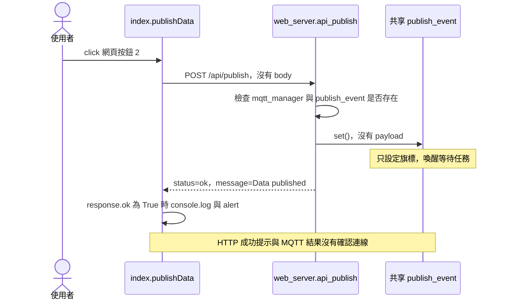

目前 handler 的檢查是物件存在，不是 `is_connected()`；不存在時也只印警告並回成功。圖示只涵蓋存在分支。路由內沒有取得溫濕度、沒有將讀值存入 Event，也沒有直接呼叫 `mqtt_manager.publish()`。

### 9.2 後半段：誰真的讀資料與發送？

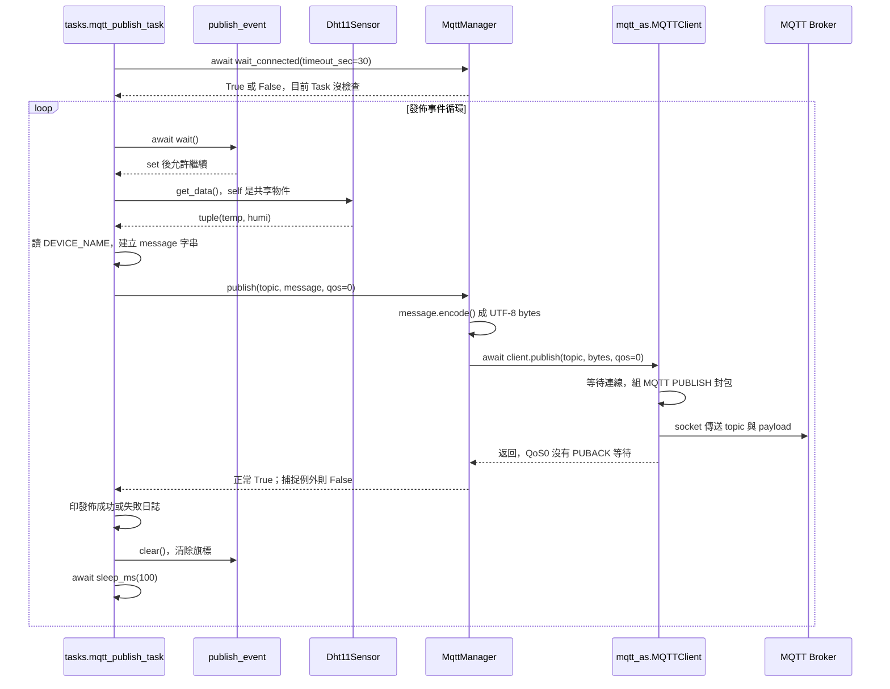

兩張時序圖是兩條獨立工作的路徑，**不得串成「HTTP 一定先回覆，然後 MQTT 才開始」**。set 後任務可在事件迴圈下一個排程機會繼續，實際網路完成先後依排程與 I/O 決定。確定的是 route 沒有等待 MQTT 結果。

### 9.3 參數追蹤到函式庫

| 層級 | 呼叫與參數 | 來源 | 保存／結果 |
|---|---|---|---|
| Browser | `publishData()` | click；無自訂參數 | async 呼叫範圍 |
| HTTP | `fetch('/api/publish',{method:'POST'})` | 固定值 | 沒有傳溫度／濕度或 message |
| Route | `api_publish(request)` | Microdot 解析該請求 | 讀共享物件，未讀 request body |
| 通知 | `publish_event.set()` | main 建立與注入的 Event | 設定一個待處理條件 |
| 任務 | `mqtt_publish_task(dht_sensor,mqtt_manager,publish_event)` | main 以三個相同物件參照呼叫 | 長期存在的協程 |
| 取值 | `dht_sensor.get_data()` | 物件當時的兩個屬性 | tuple；不重新 measure |
| 組文 | `message = f'{config.DEVICE_NAME}：溫度：{temp}℃, 濕度：{humi}%'` | 裝置名稱來自 config，數值來自 get_data | task 區域字串 |
| 主題 | `config.MQTT_TOPICS['temp_humi']` | bytes 設定 `b'nuu/csie/iot1133/TempHumi'` | 模組配置，可重用 |
| 品質 | `qos=0` | task 固定傳入 | 不等待 QoS1 的 PUBACK |
| 管理器 | `MqttManager.publish(topic,message,qos=0)` | task 的三個參數 | str 若需要則 `.encode()`，最後回 bool |
| Client | `MQTTClient.publish(topic,msg,retain=False,qos=0)`，`lib/mqtt_as.py:797` | manager 沒指定 retain，故使用預設 False | 等待連線／必要時重連再發送 |
| 基底 | `MQTT_base.publish(...)`，`:409` | 以相同 topic/msg/retain/qos 往下 | 取得寫入 lock，呼叫 `_publish()` |
| 封包 | `_publish(...,dup=0,pid)`，`:430` | 基底產生 pid；此 QoS0 不將 packet ID 放入封包 | 建立 MQTT header，topic 長度／topic／payload |
| Socket | `_send_str(topic)`、`_as_write(msg)`，`:255`／`:232` | topic 與已編碼 bytes | 分段寫入 socket；等待時讓出事件迴圈 |

Broker 地址來自開機的 `MqttManager`，Browser 不需要知道它。現有函式庫預設 SSL=False，port=0 時取 TCP 1883；講義僅說明此專案路徑，不建議把這些預設當作所有部署的安全配置。

中文 message 由 UTF-8 編碼成 bytes；byte 長度不等於字元數。JSON 只用於 Web 回應；這個 MQTT payload 是人類可讀文字，不是 JSON。

### 9.4 Event 的資料與生命週期

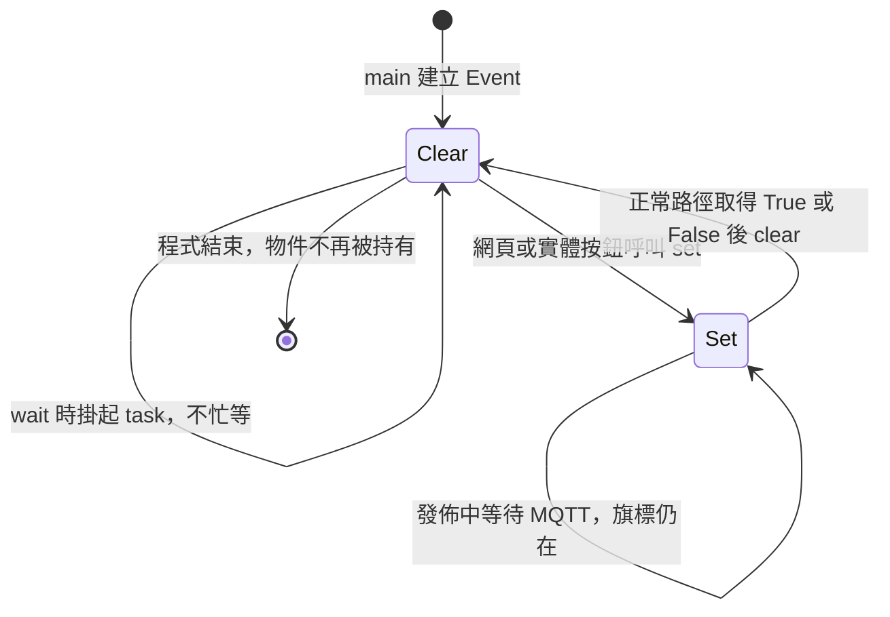

Event 不是資料佇列，內部不保存每一次點擊、溫濕度或 request ID。它只表示「需要發佈」；message 是 task 在真正處理時讀取快取才產生。所以發送值可能與使用者點擊當時的畫面略有差異。

多次 set 會合併；發佈期間另一次 set，也可能被後續 clear 一起清除。這是通知機制的限制，不代表全部點擊都有一筆消息。`clear()` 清的是條件旗標，不清感測快取、不刪 message 字串，也不清 Broker 資料。

task 會在 loop／await 間保存區域變數；message 常在下一次建立新字串時才被取代。只有舊物件不再被 task／client 等參照時，才能由 GC 回收，不能說「clear 後 message 立即消失」。

正常呼叫取得 False 也會 clear；若例外在其他步驟跳到外層 catch，clear 可能未執行，旗標可繼續維持 set。若 client 在斷線中持續等待／重連，該 task 的這次 publish 也可能長時間沒有返回。

Event 的 wait 是協程等待，沒有在 Python 無限輪詢旗標；它讓其他任務執行。官方 API 的任務內 set／clear／wait 規約見 [MicroPython asyncio](https://docs.micropython.org/en/latest/library/asyncio.html)。本專案兩種 set 來源皆為 asyncio 任務，沒有從硬體 IRQ 直接 set。

### 9.5 發佈完成要區分四個層次

| 層次 | 此程式觀察到什麼 | 能否保證下一層？ |
|---|---|---|
| HTTP 回應成功 | 路由走到回應，通常已 set Event | 不能保證 MQTT 已完成 |
| manager 回 True | client 的 publish 正常返回 | QoS0 不能保證 Broker 確認接收 |
| Broker 收到並轉送 | 需要另觀察 Broker／訂閱者 | 不保證訂閱應用保存或處理完成 |
| 訂閱者處理完成 | 需應用層確認／外部觀察 | 目前網頁沒有追蹤 |

QoS0 是協定的 at-most-once 交付層級，不包含 PUBACK；本地 client 的重連重試策略也不能提升成「應用動作一定恰好一次」。retain=False 不要求 Broker 保留這次消息作為新訂閱者的最新值；Broker 是否額外寫日誌／資料庫是外部配置，不可由此推斷。相關語意見 [MQTT 3.1.1 規範](https://docs.oasis-open.org/mqtt/mqtt/v3.1.1/mqtt-v3.1.1.html)。

成功 alert 只看 HTTP `response.ok`，沒有等待背景發佈、沒有解析 result ID。用外部訂閱者收訊才可驗證消息確實抵达該訂閱者。實體按鈕 2 同樣只 `publish_event.set()`，共用背景任務，但不會觸發網頁 alert。

## 10. 失敗分支：畫面提示不等於所有故障都被偵測

| 情境 | ESP32／Browser 實際路徑 | 使用者可能看見 |
|---|---|---|
| DHT 量測失敗 | 寫入 -1／-1，API 仍組 `status=ok` | -1，status 仍正常 |
| DHT 物件缺失 | helper 回 None，串接出 `"temp": None` | 非合法 JSON，`response.json()` 拋例外，顯示連接失敗 |
| ADC 讀取例外 | sensor 回舊 current_value | 看似有數值，沒有 stale 訊號 |
| 光照為 0 | Browser 的 `data.light || '--'` | 顯示 `--` 而不是 0 |
| LED 物件不存在／沒有方法 | route 不執行 GPIO，但可能回 200／ok | console 顯示 LED 已切換 |
| LED handler 拋例外 | 回 HTTP 500 | `response.ok=False`，toggleLED 目前沒有 else 提示 |
| 發佈 handler 拋例外 | 回 HTTP 500 | publishData 沒有 else，通常不會 alert 失敗 |
| 發佈物件未初始化 | route 印警告仍回 ok | 成功 alert，但 Event 可能没 set |
| MQTT publish 等待／失敗 | 背景 task 等待或印失敗 | HTTP 成功 alert 可能早已顯示 |
| fetch 網路例外 | 該 JavaScript catch 執行 | 資料區顯示失敗，或發佈按钮顯示失敗 alert |
| 資料請求恢復成功 | 數字重新寫入，未重置 status | 新數值搭配舊失敗文字 |

伺服器錯誤回應是手動將 `str(e)` 串進 JSON，未跳脫引號／換行，正文可能不合法。兩個按鈕不呼叫 `response.json()`，因此它們的成功判斷與正文內容脫鉤。这些是目前行為的說明，本講義沒有修正它們。

`/api/status` 雖然有 `api_status(request)`，目前僅回固定 `{"status":"ok","message":"System running"}`，沒有 uptime，也沒有被網頁呼叫；`sensor_monitor_task()` 每 10 秒休眠，尚未做實際健康檢查。不要將兩者畫成現有狀態欄的資料來源。

## 11. 資料存放、產生、覆寫與消失總表

「消失」至少分成三種：名稱被新值覆寫、物件變成無參照可回收、輸出／訊息的外部效果結束。三者的時間不相同。

| 資料／狀態 | 在哪裡 | 如何產生 | 如何更新或清除 | 持久性與注意 |
|---|---|---|---|---|
| `index.html`／Python 原始檔 | ESP32 Flash 檔案系統 | 上傳部署 | 再上傳／刪檔才改變 | 斷電通常仍在；不是瀏覽器執行狀態 |
| `config` 常數／topics | ESP32 模組記憶體，來源為檔案 | import 時執行指定 | 改值或重啟重新匯入 | 改 RAM 不自動寫回 Flash |
| Microdot app 與 route mapping | ESP32 RAM | `Microdot()` 與 decorators | 結束／重建 app | 登記 handler，不等於已執行 HTTP |
| `HTML_PAGE` | ESP32 模組 RAM | `load_html()` 的 read | 再次指定、重啟 | 關閉檔案不清它；通常不逐請求讀檔 |
| DHT／ADC／LED 物件參照 | main、task 與 web 模組 | 初始化與注入 | 無參照／程式結束後可回收 | 多個名稱指向同一物件 |
| DHT `temperature/humidity` | 感測物件屬性 | 初始化 0，量測更新 | 下一次量測覆寫，失敗寫 -1 | 沒有保存歷史／age |
| ADC `current_value` | 光感物件屬性 | 初始化 0，成功 ADC 讀取 | 新成功讀取覆寫 | 失敗可保留舊值 |
| LED `current_color_index/is_on` | LED 物件屬性 | 初始化／設定顏色 | 換色覆寫、off 改 is_on | 不因 HTTP 結束而消失 |
| GPIO 輸出電位 | MCU 硬體暫存器／腳位 | `Pin.value(0/1)` | 下一次寫入、重設、失去供電等 | 與 Python 字串生命周期不同 |
| Python HTTP request／Response／區域字串 | ESP32 handler／框架 | 每次請求解析、回應組裝 | 完成且無參照後可回收 | 沒有自動保存每筆歷史 |
| 瀏覽器 Response／data | Browser JS | fetch 與 JSON 解析 | 協程結束且無參照後可回收 | 與 ESP32 物件不同 |
| DOM 五個數值／status | Browser DOM | HTML 初值／textContent | 下次指定、重新載入／離開頁面 | 資料請求結束不會清文字 |
| setInterval 計時器 | Browser 執行環境 | 登记 callback 與 1000ms | clearInterval 或頁面環境結束；目前未保存 ID | 刷新頁面會在新頁面重新登記 |
| `publish_event` 的旗標 | ESP32 RAM | 初始 clear，set 改變 | task 正常路徑 clear，或重建 | 不保存 payload／次數 |
| `_connected_event`／`_connected` | MqttManager | 初始化後連線 callback 設定 | 與 publish_event 獨立 | 不代表每次發佈完成；斷線旗標處理仍有限 |
| MQTT `message`／bytes／packet | task、manager、client 執行狀態 | 讀快取、組字串、encode、組包 | 下一輪覆寫或無參照後回收 | await 期間可能仍被持有 |
| Browser console／alert、序列日誌 | 各執行環境／外部工具 | log／print／alert | 依工具保存策略；alert 可關閉 | 本程式未提供持久日誌資料庫 |
| Broker／訂閱者的消息 | 外部系統 | 收到 MQTT PUBLISH | 依外部配置與消费方式 | 此專案無法決定外部是否保存歷史 |

RAM 回收由 runtime／GC 決定，無參照不等於立即擦除記憶體。重啟會重建應用狀態，但 Flash 原始檔留存；瀏覽器重新載入只重建頁面，不會重啟 ESP32 或清除 LED 色碼。

## 12. 理論對照：從此案例學到什麼？

| 觀念 | 在本案的具體位置 | 能解釋的現象 |
|---|---|---|
| Client／Server 與序列化 | fetch→HTTP→Python→JSON→JS | 跨機器只能交換訊息，不能共享物件指標 |
| 路由／控制反轉 | `@app.route` 登記 handler | 使用者請求到來，由框架呼叫函式並給 request |
| 相依注入與 alias | `web_server.dht_sensor=dht_sensor` | 背景寫入後，Web 能看到同一物件新值 |
| 取樣與快取 | DHT 約每 2 秒量測，Web 約每 1 秒查詢 | 兩次網頁刷新可能顯示相同 DHT 值 |
| 命令與查詢 | GET data、POST LED／publish | 查詢輸出資料，命令要求改變狀態／觸發工作 |
| 直接呼叫與事件解耦 | LED 直接 next_color；publish 先 set | 兩個按钮的完成路径與回覆能力不同 |
| 協同多工 | uasyncio 的 await | 等網路／事件時其他任務仍可工作，同步長操作仍可阻塞 |
| 位元／模數 | RGB 色碼與 `%8` | 8 色組合與 7→0 循環 |
| 局部狀態與硬體状態 | LED 屬性／GPIO 寫入 | HTTP 結束後顏色仍保持 |
| 通知與佇列不同 | Event set／clear | 連點可能合併，沒有每點一筆保證 |
| 分散系統確認層級 | HTTP 回應、MQTT 返回、訂閱者接收 | 成功提示無法直接證明最終處理 |
| 資料品質與可觀測性 | -1／舊 ADC／固定正常 | 画面有數字不等於資料健康 |

`textContent` 寫的是文字，不將回傳值當 HTML 標籤解析；本案例更新現有 DOM，沒有重新取得整頁。[DOM textContent](https://developer.mozilla.org/en-US/docs/Web/API/Node/textContent)

## 13. 上課操作與討論題

### 實驗 A：觀察顯示資料流

1. 確認板上程式啟動、取得 WiFi IP，再由同網段 Browser 開 `/`。
2. 開啟開發者工具 Network，過濾 `api/data`，比較每次請求與 Response 正文。
3. 對照 DOM：同一溫度更新兩個 ID；濕度也相同；光照只更新一個 ID。
4. 觀察 DHT 兩秒取樣與一秒查询的差異；改變光線，對照 ADC。實際間隔以觀察結果為準。

### 實驗 B：觀察 LED 路徑

1. 確認光感自動控制開關為 False，開機白色 7。
2. 按網頁按鈕 1，查看 Network 的 POST，確認沒有色碼 request body。
3. 觀察 GPIO 顏色 7→0→1→2，與 Python 物件的索引計算對照。
4. 查 Browser console 與 ESP32 序列日誌，區分網頁操作與實體按鈕日誌。

### 實驗 C：觀察發佈觸發與最終收訊

1. 使用外部 MQTT 訂閱者監聽 `nuu/csie/iot1133/TempHumi`；此為目前設定，教室共用需避免其他組消息混入。
2. 按網頁按鈕 2，對照 HTTP 回應、alert、序列發佈日誌與訂閱者消息。
3. 討論是否能僅憑 alert 宣稱消息抵達；斷開 Broker 情境時，本地 HTTP 仍可成功嗎？
4. 快速多次點擊，觀察次數與消息數是否相同，解釋 Event 合併與 clear 時機。此實驗僅觀察現有行為，不要求每次點擊必然丟失或必然保留。

### 討論題

- 網頁為何不必知道 DHT GPIO，也不必傳入新色碼？
- `self`、Python `request`、JS `data` 三者的來源是否相同？
- 若瀏覽器刷新，LED 是否回到白色？若 ESP32 重啟呢？
- `publish_event.clear()` 為何不會清掉感測值？
- 為何兩秒量測／一秒刷新不代表資料一定小於兩秒？
- 如果需要每次點擊均有完成回覆，應加入哪些資料與契約？

最後一題可延伸有界 queue、request ID、結果查詢／ack，但那些是改進方案，不是現有實作。

## 14. 程式定位索引與參考

以下連結是本機專案的絕對路徑；講義移到其他電腦時可依檔名／函式名定位。

| 閱讀目的 | 程式起點 |
|---|---|
| 系統物件建立 | [main.py:29](G:/AsusWebStorage/2025/00_Teaching/114-1-csie@nuu/114-1-物聯網軟體架構/99_All_07_refactor/main.py:29) |
| 物件注入與任務啟動 | [main.py:90](G:/AsusWebStorage/2025/00_Teaching/114-1-csie@nuu/114-1-物聯網軟體架構/99_All_07_refactor/main.py:90) |
| HTML 載入 | [web_server.py:29](G:/AsusWebStorage/2025/00_Teaching/114-1-csie@nuu/114-1-物聯網軟體架構/99_All_07_refactor/web_server.py:29) |
| 感測資料 API | [web_server.py:131](G:/AsusWebStorage/2025/00_Teaching/114-1-csie@nuu/114-1-物聯網軟體架構/99_All_07_refactor/web_server.py:131) |
| LED API | [web_server.py:163](G:/AsusWebStorage/2025/00_Teaching/114-1-csie@nuu/114-1-物聯網軟體架構/99_All_07_refactor/web_server.py:163) |
| 發佈 API | [web_server.py:189](G:/AsusWebStorage/2025/00_Teaching/114-1-csie@nuu/114-1-物聯網軟體架構/99_All_07_refactor/web_server.py:189) |
| 前端定時更新 | [index.html:238](G:/AsusWebStorage/2025/00_Teaching/114-1-csie@nuu/114-1-物聯網軟體架構/99_All_07_refactor/index.html:238) |
| 前端兩個按鈕 | [index.html:264](G:/AsusWebStorage/2025/00_Teaching/114-1-csie@nuu/114-1-物聯網軟體架構/99_All_07_refactor/index.html:264) |
| 感測值如何產生 | [hardware/sensors.py:11](G:/AsusWebStorage/2025/00_Teaching/114-1-csie@nuu/114-1-物聯網軟體架構/99_All_07_refactor/hardware/sensors.py:11) |
| LED 色碼如何套用 | [hardware/led.py:25](G:/AsusWebStorage/2025/00_Teaching/114-1-csie@nuu/114-1-物聯網軟體架構/99_All_07_refactor/hardware/led.py:25) |
| 背景量測 | [tasks.py:71](G:/AsusWebStorage/2025/00_Teaching/114-1-csie@nuu/114-1-物聯網軟體架構/99_All_07_refactor/tasks.py:71) |
| 背景發佈 | [tasks.py:173](G:/AsusWebStorage/2025/00_Teaching/114-1-csie@nuu/114-1-物聯網軟體架構/99_All_07_refactor/tasks.py:173) |
| MQTT adapter／編碼 | [communication/mqtt_client.py:91](G:/AsusWebStorage/2025/00_Teaching/114-1-csie@nuu/114-1-物聯網軟體架構/99_All_07_refactor/communication/mqtt_client.py:91) |
| MQTT client 發佈入口 | [lib/mqtt_as.py:797](G:/AsusWebStorage/2025/00_Teaching/114-1-csie@nuu/114-1-物聯網軟體架構/99_All_07_refactor/lib/mqtt_as.py:797) |
| 可公開的設定範本 | [config.example.py](G:/AsusWebStorage/2025/00_Teaching/114-1-csie@nuu/114-1-物聯網軟體架構/99_All_07_refactor/config.example.py) |

框架說明以官方文件為參考，實際 API 依裝置已安裝版本確認。`lib/mqtt_as.py` 為此專案隨附實作，應優先閱讀它來理解此裝置行為。講義中的示例數值不代表實際量測結果。
